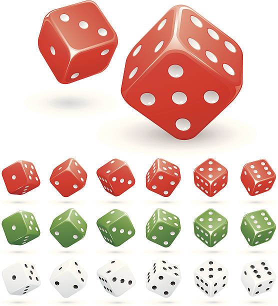
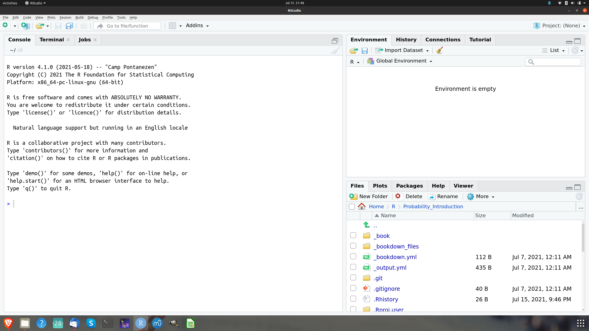
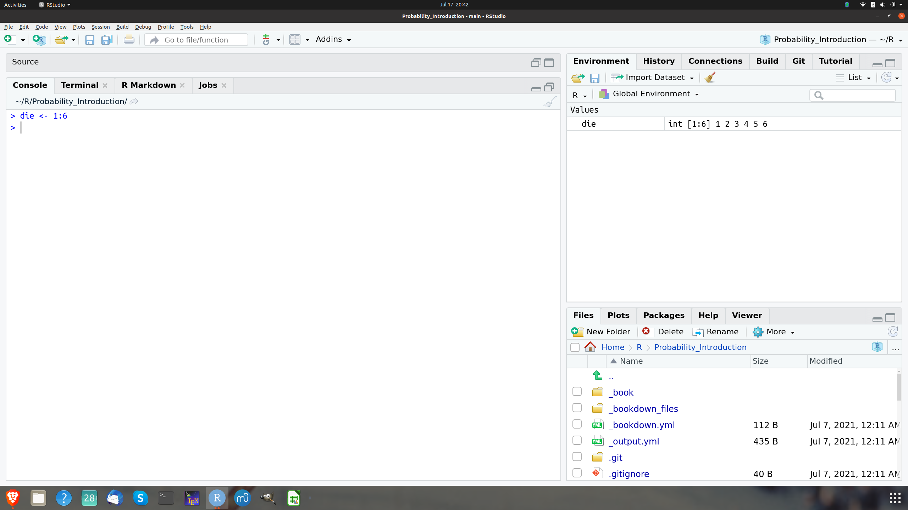
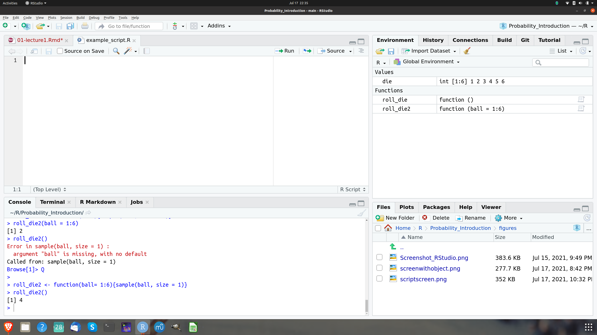
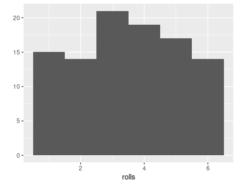
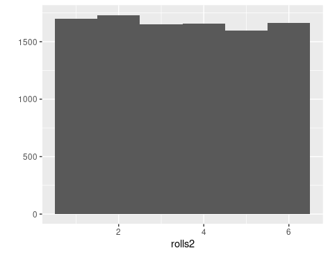

# First probability ideas and first steps in R

If you chose to study Finance it should be natural for you to also study probability. 
After all, Finance studies the allocation and pricing of money across time. You can
safe money to use it later for purchasing goods and services. You can also borrow money to
invest today and repay in the future from the revenues of your project. But the 
future is uncertain and we do not know today how it will look like tomorrow. 

In Finance we therefore unavoidably
have to deal with risk and uncertainty. The most fundamental concept we have available
to deal with risk and uncertainty and to think about and analyze it is probability. Therefore
every serious student of Finance has to study probability early on.

But of course probability is first of all a mathematical theory. It gets practical value
and intuitive meaning in connection with real or conceptual experiments. Indeed these 
fascinating interconnections are already visible in the very beginning of probability, which 
emerged in the 16th and 17th century in Europe in the context of practical as well as 
scholarly discussions about
gambling. These discussions engaged the greatest minds of their times, with names like Gerolamo
Cardano (1501-1576), Galileo Galilei (1564 - 1642), Blaise Pascal (1623-1662), 
Pierre Fermat (1601 - 1665), Christiaan Huyghens (1629 - 1695), 
Jacob Bernoulli (1654 - 1705), Abraham de Moivre (1667 - 1754), 
Thomas Bayes (1701 - 1761) and Pierre Simon de Laplace (1749 - 1825).

While people were aware of chance at all times, liked to gamble or even had a godess of chance
like the Greeks it seems only later it occurred to people that something as elusive as uncertainty
or chance could perhaps be measured. This is the starting point for classical probability. 
It is also a very good starting point to familiarize ourselves with some basic concepts and
knowledge of R by building a simple chance game people apparently had enjoyed playing at
all times: Rolling a die. We will learn how to roll a die using the computer.

What has a die to do with Finance, some of you might ask. To those of you, who think so
I would say: Perhaps more than you think. But clearly this is still an example quite
removed from an actual Finance context, I agree. But be patient and bear with me. The
building of a die, which can be rolled on the computer is a simple but extremely rich
example which can lead us straight both into probability and into R at the same time and
get us started for actual probability applications in Finance.

## Rolling a die: First Probability ideas.

Lets start with a classic and old example of a probability model, which occupied the attention of
Pascal and Fermat as well as their gambling friend the Chevalier de Mere: Rolling a six sided die. 

When you role a die or several dice like shown in the following picture, it is uncertain on which face it will finally end up after the throw.

```{r dice, out.width='25%', fig.align='center', fig.cap='Rolling dice: An old game of chance', echo = F}


```

What seems clear, though is that it will turn out that it is either one of 
the six possible faces of the die.

### Random experiments, sample space, events

In the theory of probability a process leading to an uncertain outcome is called a
**random experiment**. The example of throwing a die helps us to give a precise meaning
to the notion of an uncertain outcome. While we can imagine in principle that the die lands on
one of its corners and this is one outcome, we agree *on the outset* that we are going to 
consider the (practically relevant cases) that it will land on one of the faces.

The collection of all possible outcomes of a practical or conceptual random experiment is called
in probability theory a **sample space**. While the sample space of throwing a die is an 
idealization it is exactly this idealization which simplifies the theory without affecting
its applicability. The basic outcomes in the random experiment of throwing a die are that the 
die lands such that the upward showing face shows a 1 a 2, 3, 4, 5 or a 6. In the theory
the collection of basic outcomes is denoted as a set. Thus the sample space of throwing a die
is given as the set ${\cal S} = \{1,2,3,4,5,6\}$.

The sample space ${\cal S}$ is the set of all basic outcomes. The *subsets* of the sample space
are often called **events** in probability theory. An event could be - for example -
an outcome where the die shows an upward looking face with an even number $A = \{2,4,6\}$.

### The role and nature of idealizations in applications

Idealizations of the kind we discussed for the throw of a die are standard in probability and
we will encounter them again and again. For example the movement of a stock price is often 
though of as a conceptual random experiment. When we try to agree on what is the
appropriate sample space of this experiment, we can say that the price can not fall below
0 but it is hard to agree on what will be the highest possible price. In the probabilistic
treatment of stock prices, which we will discuss later in our course, it is for instance
common to assume that the sample space of this random experiment is the entire interval of
non-negative real numbers ${\cal S} = [0, \infty)$.
Many of us would
hesitate to claim that the price might rise without bound. Yet many models in applied
Finance are based on such an assumption. The models allow arbitrary price hikes but with arbitrary
small probability as the price gets higher and higher. Practically it does not make sense
to believe that a security price can become arbitrarily high. The use of arbitrarily small
probabilities in a financial model might seem absurd but it does no practical harm and makes
the model simple and convenient to use. Moreover, if we seriously introduced an upper bound 
on a security price at $x$ it would be also awkward to assume that it is impossible that it
could be just a cent higher, an assumption equally unappealing than assuming it can get in
principle arbitrarily high.

### Classical Probability: Measuring uncertainty

**Probability** is a measure of how likely an event of an experiment is. But how could we measure
chance? Here is the first big idea of probability theory and how the originators thought about it.
How do you measure anything? If you think of length, for example, you take an arbitrary standard
you agree on and then count. The originators of probability theory pursued the same idea with
chance: To measure probability you choose equally probable cases and then count.

The probability of an event $A$ according to the originators of the theory of probability is then
\begin{equation}
P(A) = \frac{\text{Number of cases where $A$ occurs}}{\text{Total number of cases}}
\end{equation}

Thus, if we want to know the probability of the die ending up on a face such that an 
even number is shown we have to compute according to this notion $3/6$ which is a
chance of $50 \%$. 

Note that this classical notion of probability has a few interesting consequences, which we
will discuss in more detail later but which naturally flow from this basic idea of measuring
chance. 

1. Probability is never negative.
2. If an event $A$ occurs in all cases $P(A)=1$.
3. If $A$ and $B$ never occur in the same case, then $P(A \,\text{or}\, B) = P(A) + P(B)$.

In particular then the probability that an event does not occur is 1 less the probability
that it occurs: $P(\text{not}\, A) = 1 - P(A)$.

Let us interrupt here our discussion of 
probability for a moment and ask how we can make good on our promise to
make these ideas tangible, so we can play with them. 

For this we will need the
computer. Since we will talk to the computer in R, it is now the right time
to look at the die rolling example from the perspective of R and dive into
some of its basic concepts.

## Rolling a die on the computer: First steps in R

### The R User Interface

Before we can ask our tool to do anything for us, we need to know how to talk to
it. In our case RStudio allows us to talk to our computer. It works like any other
application. When you launch RStudio on your computer, you will see a screen looking like
this:

```{r rstudio-start-screen, out.width='90%', fig.align='center', fig.cap='The RStudio startup screen', echo = F}

```

In this picture you see a screenshot of my RStudio screen. Interacting with the app is easy. You
type commands via your keyboard at the prompt, which is the `>` symbol. You find this
symbol in the RStudio pane called **Console**. You can see it in
the left pane in  the screenshot. You send the command to the computer 
by pressing enter. After you have pressed enter, RStudio 
sends the command to R and displays the result of your command with
a new prompt to enter new commands, like this:

```{r add-two-numbers}
1+1
```
Let me pause here to explain what you see here. First you see a light-gray box
containing the command `1+1`. This is an instance of a so called code chunk. Moving the 
cursor to the right upper corner of the chunk, will display a copy icon and you can click
this icon to copy the code, paste it at the prompt of your console and run it 
in R studio, if you wish. In the code-chunk the prompt `>` is not displayed. This symbol of 
the prompt is only shown in the Console.

When the code is executed, you see the result in the second light-gray box, just below the first
one. It starts with a double hash `##`, indicating that it shows
an output of running the above code chunk and then displays the output as it would appear in the
command window `[1] 2`.

The `[1]` means that the line begins with the first value of your result. For
example, if you enter the command `20:60` at the prompt of your console which means 
in the R language, "list all the integers from 20 to 60" and press enter you get:
```{r list values}
20:60
```

meaning that 20 is the first value displayed in your result. Then  there is a 
line break because not
all values can be displayed on the same line and R tells you that `45` is the 
26-th value of the result.

The colon operator `:` is a very useful function in R which we will need often. It allows us
to create sequences of every integer between two given integers.

R needs a complete command to be able to execute it, when the return key is pressed. 
Lets see what happens, if a command is incomplete, like for instance
```> 5*```. 

In this case R will show the expression followed by a `+` instead of showing a new prompt. This
means that the expression is incomplete. It expects more input.
If we complete the expression, say like

```
> 5*
+ 4
```
the expression can be evaluated and a new prompt is shown in the console.


If you type a command that R does not understand, you will be returned an error message. 
Don't worry if you see an error message. It just is a way the computer tells you that he does 
not understand what you
want him to do.

For instance, if you type ```5%3``` you will get an error message like this
```
> 5%3
Error: unexpected input in "5%3"
>
```
Sometimes it is obvious why a mistake occurred. In this case, that R just does not 
know what to do with
the symbol `%`. It has no meaning in this context. Sometimes it is 
not so obvious what the error
message actually means and what you might do about it. 

A useful strategy in this 
case is to type
the error message into a search engine and see what you can find. The chance is very 
high that others
encountered the same problem before you and got helpful advice how to fix it from other users on 
the internet. One site, we find particularly helpful for all kinds of questions related to R
and R programming is https://stackoverflow.com/. Try it at the next opportunity.

Now with this basic knowledge, we can already make the first step to create a 
die on the computer
using R. If you think of a physical die, the essential thing that matters are 
the points on its
six sides. If you throw the die it will usually land on one of these sides 
and the side which is
on the upper side of the die shows the number of points. 
The colon operator `:` gives us a way to
create a group of numbers from 1 to 6. R gives us the result as a 
one dimensional set of numbers.

```{r points-die}
1:6
```

Lets use these first steps in R to recap the probability concepts we have learned using this
example of the six sided die:
A *basic outcome* of rolling a six-sided die is for example ```6``` if the upper side after
rolling the die happens
to be the side with 6 points. The *sample space* of  the experiment of rolling a six-sided die is
the set ${\cal S} = \{1,2,3,4,5,6\}$. In probability theory we often use the symbol ${\cal S}$ or
$S$ for sample space. In many probability texts the sample space is also often denoted by
the symbol $\Omega$ the Greek letter for (big) Omega. A *random experiment* in this example is
the rolling of the die. The outcome is uncertain but once the die is rolled the outcome
can be determined precisely. The event that the outcome is a display
of 10 points is the empty set $A = \emptyset$. The symbol $\emptyset$ comes from set theory and
means the set containing no elements. This event can contain no elements because we can not get
a score of 10 by rolling a six sided die.

### Objects

You can save data in R by storing them in **objects**. 
An object is a name, you can choose yourself to
store data. For example, if you choose to store the value ```6``` in an object called ```point_six```,
you would type:

```{r storing-object}
point_six <- 6
```

at the prompt. R will the store the value 6 in the object called ```point_six```, which
you can use to refer to the value. If you type the name of your object at the prompt, R
will display the value you have assigned. A useful key combination for typing the assignment
operator ```<-``` is to use the key combination ```ALT _ ```. At the R prompt R will automatically
print an assignment operator. 

```{r}
point_six
```


Now you can use the name of the object to refer to its value. For instance, you could divide 
```point_six```by ```2```and get a meaningful result

```{r referring-to-object}
point_six/2
```

Now to make our ```die``` more tangible and useful, let us store it in an R object by
typing the following command at the prompt. This command creates an object with name
```die``` and assign the vector ```1,2,3,4,5, 6``` to it.

```{r create-die}
die <- 1:6
```

```{r, out.width='90%', fig.align='center', fig.cap='The RStudio Environment pane keeps track of the objects you have created', echo = F}

```

You can now see in the right upper Environment pane that R shows you that there is an 
object with the
name ```die``` that it consists of integers ```1,2,3,4,5 ```. As you create more 
objects they will be
stored in the Environment pane and are ready for your reference, unless you 
delete them. You can remove or delete an object by typing `rm(object)`
or by assigning the value `die <- NULL` which would also remove the object from your
environment or workspace.

You can name your objects almost anything with a few exceptions. An object name must not start with
a number. There are some special symbols which can also not be used in object names, like
`^, !, $, @, +, -, /, *`. Note that R is case sensitive and distinguishes small and big
letters. If you assign a new value for an object you have already created, R will overwrite the
object without warning.

You can see which objects are currently created and available for you in the Environment pane
of your session of by typing `ls()`. The UNIX users among you will recognize this command
from the unix shell, where it displays the files in a directory.

Before we learn how we can actually roll our die and perform a random experiment with it, let us 
briefly use the opportunity to explain a few things about how R does computations. We have
already explained that we can use the object name to refer to the value. So for instance
if we type

```{r multiply-die}
die*die
```

This might irritate some of you because we have called the object a vector. In linear
algebra multiplication of vectors is only allowed if there is an inner product. What happens
here, if we use `*` the multiplication operator is that R does an element-wise multiplication
of the six numbers of our die. Of course R allows to take an inner product as well, but this needs
a different operator. To compute an inner product, we would type

```{r inner-product}
die %*% die
```

Now R displays the result as a vectors with one row and one column, which is denoted in the output by
`[ , 1]` for the column and `[1, ]` for the row. We will learn later more about 
the use and the meaning of this notation in R.

The element wise execution R usually uses also means that when you, for example type

```{r}
die - 1
```
R would subtract `1` from every component in the vector `die`. 

Another specific behavior of R, you need to know about is called "recycling". If you give
R two vectors of different length in an operation, R will repeat the shorter vector as long as
it is of equal length with the longer one. For example, if you have:
```{r recycling}
die + 1:2
```

you see that R adds 1 to 1 and 2 to 2 and then starts over again by adding 1 to 3 
and 2 to 4 and then
starts over once again by adding 1 to 5 and 2 to 6. If the longer vectors is 
not a multiple of the shorter one, R recycles but the cuts off. 
It will give you a warning though.
```{r recycling-warning}
die + 1:4
```

While this might seem awkward to some of you, we will see that for data manipulation
element-wise execution is often extremely useful. It allows to manipulate groups of values in 
a systematic way.

### Functions

R contains many **functions** which we can use to manipulate data and compute things. 
The syntax for
using a function is very simple: You type the function name and put the value of the function
argument in parentheses. Here we use for illustrations the function of the square root 
`sqrt()`:
```{r sqrt-function}
sqrt(4)
```
or rounding a number:
```{r round-function}
round(3.1415)
```
The data you write in the parentheses are called the function arguments. 
Arguments can be all sorts of
things: raw data, R objects, results from other functions. 

If functions are nested, R evaluates the
innermost function first and then goes on to the outer functions. To see 
examples of all these instances you can take
```{r evaluation-example}
mean(1:6)
mean(die)
round(mean(die))
```
for example. 

For simulating random experiments, R has the very useful function 
`sample()`. With this function
we can roll our die on the computer and conduct actual random experiments. 

The function takes
as arguments a vector names `x` and a number named `size`. `sample` will return
`size` elements randomly chosen from the vector `x`. Lets say:
```{r illustrate-sample-function}
sample(x = 1:4, size = 2)
```

In this case `sample` has chosen `4,1` from the vector `x = (1,2,3,4)`. If we want
to roll the die in our computer we can thus pass the die as an argument to `sample` and
use the number `1` for the `size` argument. Lets do a few rolls with our die
```{r roll-die}
sample(x = die, size = 1)
sample(x = die, size = 1)
sample(x = die, size = 1)
sample(x = die, size = 1)
```
These are the random outcomes of our consecutive rolls. It is as if we had thrown an
actual die but in this case we have done the same thing on the computer. Isn't it cool that 
this is possible at all? The `sample()` function will remain our good friend throughout this 
course.

R functions can have many arguments, but they need to be separated by a comma.

Every argument in every function has a name. We specify which data are assigned to the 
arguments by setting the name equal to the data. Names help us to avoid passing the wrong
data and thereby mixing up things or committing errors. But using names is not
necessary. If we just wrote
```{r names-not-necessary}
sample(die,1)
```
R would also know what to do. It is not always clear which names to use for a function. If you are
not sure, you can use the function `args()` to look it up. Here we take the 
function `round`as one example.
```{r}
args(round)
```
Note that the ```digits``` argument in the `round` function is already set to `0`. Frequently
R functions come with optional arguments. These arguments are optional because the come with a 
default value, which is `0` in case of the round function. 

We recommend that you write out argument names as a rule. It gives clearer code and avoids
errors. If you don't write argument names, R matches your values to the arguments of the
function by order.

### Writing your own functions

Now we are ready to write our own function to roll the die in our computer. Each function in R
has the same elements: A *name*, a *function body* of code and a set of *arguments*. To write your
own function, you have to write up all of these parts and save them in an R object. The syntax 
is:

```
my_function <- function() {}

```
The name here is `my_function`, next comes the expression `function()` which needs to be assigned.
The names of the function arguments have to be written between the parentheses. Then we
have to write the actual code within the  braces `{}`.

To do this for the die, lets write a function named `roll_die`.
```{r function-roll-die}
roll_die <- function(){die <- 1:6 
                         sample(die, size = 1)}
```

Now we can roll our die for a few times to show how the function works
```{r roll-die-few-times}
roll_die()
roll_die()
roll_die()
roll_die()
roll_die()
```

A final remark in the `sample` function is in place here. If we look at the arguments of
sample using the `args` function we see
```{r arguments-of-sample-function}
args(sample)
```
Lets do not discuss all the details of this output but concentrate for a 
moment on the `replace` 
argument. What does this mean? 

As we saw previously we can use the sample function to
model the rolling of our die. If we set the `size` argument to `1` we get the roll of one
die. If we set the `size` argument to `n`, we would simulate the rolling of `n` dies.
But now the `replace` argument becomes crucial. As we can see in the output of the
`args` function `replace` has a default value `FALSE`. This is a logical argument.
It tells R, for example, that if we set `size = 2`, meaning that two dice are rolled, if the 
first dice shows, say a value of 3, the second die cannot show 3 as well. 

This is clearly not
what we have in mind when we model the rolling of 2 dice. It should be possible that 
both dies show the same value. To enable this behavior of the sample function, we have to
change the default value of the `replace` argument to `TRUE`. Then R chooses a random draw
from all of the six possible values for all dice rolled.

Congratulations. You have written your first R function for conducting a simple random
experiment. Think of the parentheses as a trigger that tells R to run the function. If
you omit the trigger R just prints the body of the function. When you run a function,
all the code in the function body is executed and R returns the result of the last
line of code. If the last line of code does not return a value neither will R.

### Arguments

Imagine we remove the first line of code in our function body and changed the name
die in the sample function to "ball".
```{r change-name}
roll_die2 <- function(){sample(ball, size = 1)}
```
If we call the function now, we will get an error. The function call `roll_die2()` will result in 
the error message `Error in sample(ball, size = 1) : object 'ball' not found` (tri it!)

We could supply ball when we call `roll_die2` if we make ball an argument of the
function. Lets do this:
```{r make-argument}
roll_die2 <- function(ball){sample(ball, size = 1)}
```
Now the function will work as long as we supply `ball` when we call the function.
```{r now-it-works}
roll_die2(ball = 1:6)
```
Note that we still get an error, if we forget to supply ball argument.
This could be avoided if we give the function a default argument
```{r give-default-argument}
roll_die2 <- function(ball= 1:6){sample(ball, size = 1)}
```
Now if we type:
```{r}
roll_die2()
```
everything works, just as intended.

### Scripts

So far we have worked by interacting with the console. But what if you want to edit
your functions? It would be much easier, if you could use a draft of your code and
work form there. This can be done by using a **script**. 

You create a script by going to `File > New File > R script` in the menu bar of RStudio. Using
scripts is the standard way to write code in R. It not only helps you to keep track of your code,
save it and edit it later. It also makes your work *reproducible*. You can edit and proofread your
code and share it with others. To save your script go to `File > Save As ` in the
menu bar.

```{r, out.width='90%', fig.align='center', fig.cap='The RStudio Script', echo = F}

```

RStudio has many useful features to help you work with scripts. You can for instance automatically 
execute a line in a code by using the run button. You can also execute sections of code or the
entire script. The entire script is executed by running the Source button. For all these commands
there are key short cuts which you will learn as you work more with RStudio and R.

### Using packages and finding Help

We have now a function which we can use to simulate the rolling of a die, `roll_die()`. If the 
die is *fair* it should be the case  that if we roll  the die often, all numbers should occur
about equally often. The die should not be weighted in favor of a particular value.

One way to learn whether our die is fair are *repetition* and *visualization*. These 
are tools we will need all the time, when working with data and when doing probability.
While R has many useful functions, one of the great powers is that R is constantly extended
by a huge community of users by providing packages. 

Packages are add on functions, which will
not be available when you install R. They need to be installed and loaded before you can use them.
Since packages are such a powerful tool in R we need to introduce what they are and how to use
them in the beginning.

### Packages

There are many visualization tools in R that come with the basic installation. Since the point
we want to make here is about packages, we will use a visualization function which is part of 
the package *ggplot2*, a very popular package for making all kinds of graphs. There are 
many additional functions provided with this package. For the point we want to make here
we will use just one of them, called `qplot` for quick plot.

Since `qplot` is a function in the package *ggplot2*, we first need to install this package.
To install a package you need to be connected to the internet. If you have internet connection
go to the command line and run at the command line:
`install.packages("ggplot2")`.

R displays what is
happening while executing the command.
Don't worry if you don not know what all of these messages exactly mean and don't
panic that they are displayed in red. 
All packages can be installed like this. You have just to enter the
correct name in the function `install.packages()`. The lower right pane in the RStudio software 
alternatively provides a tab called **Packages**. Using this tab, you can also install R packages
interactively by clicking the install button on the upper left corner of the Packages tab.

After installation the package is on our hard-drive but it can not yet be used. 
To use the package it has
to be loaded. This is done with the command `library`. To load the *ggplot2* package we type
```{r load-packages}
library("ggplot2")
```
and hit the return key. Many things could be said about the R package system and you will learn it
in more detail as we go along in our course. For the moment the most important 
thing to remember
is that a package needs to be newly loaded whenever you want to use it in a new R session.

To check whether our dies is fair, we need to roll it many times. 
R provides a function, that does this
for us. This function is called `replicate()` and provides an easy way to 
repeat a command many times.
The number of times we want to repeat something is given as an argument 
to the `replicate` function.

Now lets roll our die 100 times and save the result in an object we call `rolls`:
```{r}
rolls <- replicate(100, roll_die())
```
We now use the `qplot()`function from the *ggplot2* library to make a quick visualization, by
typing the command `qplot(rolls)`. I include the resulting picture in the
following figure
```{r, out.width='90%', fig.align='center', fig.cap='Frequencies of 1, 2, 3, 4, 5, 6 after rolling our virtual die 100 times', echo = F}

```

It looks like every value occurred roughly 16 times but there is still quite some variation. For instance,
the value 3 seems to occur more than 20 times whereas the value 2 occurs less than 15 times. Maybe
we have to give it another trial with more replications. With the computer we can do this with 
a fingertip. Let us roll our die 10000 times and plot the result.
```
> rolls2 <- replicate(10000, roll_die())
> qplot(rolls2m bindwidth = 1)
```
Now the picture looks better. 

```{r, out.width='90%', fig.align='center', fig.cap='Frequencies of 1, 2, 3, 4, 5, 6 after rolling our virtual die 10000 times', echo = F}

```
It seems that there is no significant visual evidence that our die is loaded.

### Getting Help

We have now learned a tiny number of R functions and we have written one function 
ourselves. We have
learned how to make use of functions provided by packages. It would be 
overwhelming to memorize and
learn them all. In R, fortunately, every function 
comes with a detailed documentation and with its own
help page. You need to learn how to use this source right from the beginning.

To access the help page of a function you type the function name preceded by a 
question mark at the prompt, like this
```{r}
?sample
```

Then, after you have pressed the return key, a help page is opened in the right 
lower pane under the
help tab. This help page has a particular structure that you will find for every other R function
no matter whether it is provided by the base installation or by a package. In  the upper left
corner you see the name of the function (`sample`) and in curly brackets next to it the term 
`base`, which means that this is a function in the R base installation. Then you see a headline
about what the function does.

From the top of the page, you then first see the field **Description**. This is a 
short description what the function does. Here it says
```
Description
sample takes a sample of the specified size from the elements of x using either with or without replacement.
```
The next field is **Usage**. It gives you the function description with the arguments. Here for example
```
Usage
sample(x, size, replace = FALSE, prob = NULL)

sample.int(n, size = n, replace = FALSE, prob = NULL,
           useHash = (!replace && is.null(prob) && size <= n/2 && n > 1e7))
           
```
The first line in Usage should by now be familiar. Don't 
worry about the second line. The function can
obviously do more than we know so far.

Next comes a list of arguments the function takes and what type of information R 
expects you to provide, as well as what R will do with this information. Here it says for example
```
Arguments
x	
either a vector of one or more elements from which to choose, or a positive integer. See ‘Details.’

n	
a positive number, the number of items to choose from. See ‘Details.’

size	
a non-negative integer giving the number of items to choose.

replace	
should sampling be with replacement?

prob	
a vector of probability weights for obtaining the elements of the vector being sampled.

...

```
We omit some information here.

Then comes a field called **Details** which gives a more in-depth description of 
the function. The next
field is called **Value**. It describes what the function returns when you run it. Then 
we have a reference to related R functions under the field **See**. Finally there is a field called
**Examples**. This field contains example code that is guaranteed to work. It shows a 
couple of different cases how you can use the function in practice.

## Application: Coincidences and the Blockchain

### The birthday problem

We learned now some basic notions of probability and of R with the example of the
rolling of a fair die. It is really surprising what already can be done by just applying
the simple ideas we have just learned. The application we want to show you now is
known to probability theorists as the *birthday problem*. It originates in a piece
of recreational maths and math-puzzles but it reaches out until cryptography, computer security
and blockchain architecture. It also gives us an opportunity to apply some of our newly
acquired R-knowledge.

The starting question in the birthday puzzle is: What is the probability that at least two 
people in a room share the same birthday, when we neglect things like leap years, and when
we assume that birthdays on any day of the year are equiprobable and the birthdays
of the people in the room are independent. We have no twins for example. Perhaps some of
you have already seen this problem before. If not, the result may surprise you. Even if
you saw the birthday problem before, perhaps not many of you have seen the connection to the
cryptography and the blockchain.

First, observe that we took our assumptions such that we are in  the frame of classical
probability like the originators of the field thought about it.

Now for the sake of familiarizing ourselves with the new concepts, let us try to map the birthday
problem into the probability notions we learned so far.

The *sample space* is the set of possible outcomes of the experiment. Assume we have $n$
people in the room. Since each person can have a birthday at any of the 365 days in the
year (note that we assumed we exclude leap years) and we have $n$ people in the room, the
possible basic outcomes are $365 \times 365 \times 365 \cdots 365$ taken $n$ times. This
will produce a set with $365^{n}$ ordered $n-tuples$. This is the sample space of this
experiment, written as ${\cal S} = \{x | x \in 365^n\}$ in set theoretic notation. It means
the sample space is the set of all ordered $n-tuples$ from the Cartesian product $365^n$.

Remember that in mathematics, a Cartesian product is a mathematical operation that 
returns a set (or product set or simply product) from multiple sets 
(in this case the sample space, 
${\cal S}$. That is, for sets $A$ and $B$, the Cartesian product $A \times B$ is the 
set of all ordered pairs $(a, b)$ where $a \in A$ and $b \in B$.

Now given this sample space we can assign a probability to the event that two people chosen at
random will have the same birthday. The denominator will this be $365^n$. The nominator for
this probability will be much more straightforward to figure out, if we compute the
complement. We discussed before that the probability of the complement of an event 
is 1 minus the probability of the event. Translated to the
birthday problem, this means we look for the 1 minus the probability that that all 
birthdays are different. The probability that
the second person has a different birthday from the first is $\frac{364}{365}$. If they are
different the probability that the third person has a different birthday from them is 
$\frac{363}{365}$ and so on for all $n$ in the room. Thus the probability of a shared birthday 
in the room is:
\begin{equation*}
P(\text{at least two people share birthday}) = 
1 - \frac{365 \times 364 \times 363 \cdots \times 365 - n +1}{365^n}
\end{equation*}
Now there is an additional thing we did not yet introduce and which we will learn 
about in the next lecture. This refers to our assumption that the individual
birthdays are independent. For the moment you need to take the
following fact on faith: The probability of independent events is the probability
of the product of these events.

Now come the surprise for those of you who did not already see the birthday problem. Assume
the group size of people is 23. Let us compute the birthday coincidence probability. For this
computation we make use of the R function `prod()` which takes a vector of numbers as input
and computes their product. For $n=23$ we need the list of numbers from 365 to 343. Now we 
can use the `:` operator and take advantage from one of its cool properties. If we formulate
the command as `365:343` then the colon operator will give us a descending list of integers
starting at 365 and ending at 343. Then the probability can be computed as
```{r coindcindence-23}
1 - prod(365:343)/365^23
```
We have used the operator `^` which is needed to compute powers. Now we see from our computation
that with 23 people the probability is already larger than 50 %. Quite stunning. You can now
verify yourself that with 50 people this probability is already at 97 %.

### An R function to compute birthday probabilities

Now let us use our knowledge about how to write R functions to write a function to
compute birthday probabilities. The function argument is the number $n$ of people in class.
The coincidence probability is given by the formula we have derived. Now
here is how we could go about writing this function:
```{r coincidence-function}
birthday_collisions <- function(n){
  1 - prod(365:(365-n+1))/365^n
}
```
Now lets verify what I have claimed before about the group size 50.
```{r group-size-50}
birthday_collisions(50)
```
Voila, indeed with 50 people in the  group the collision probability is already
at 97 %.

### Hash-functions and the blockchain

The birthday problem also plays an important role for studying coincidences more generally.
A particular important application of this idea is in cryptography, and its 
concept of so called **hash-functions**.

A hash-function maps a string of arbitrary but finite length to a fixed length string 
of output. A
very frequently used hash-function in practice is the function SHA-256, which maps its input
to a string of 256 bits^[A bit, short for binary digit, is defined as the most basic 
unit of data in telecommunications and computing. Each bit is represented 
by either a 1 or a 0]. So, you could for instance give the text of these lecture notes as an 
input to SHA-256 and it would map this into a 256-bit string, which functions like
a finger print of this text. This function is an instance of a special from of mappings 
called a *one-way-function* meaning that it is easy to evaluate or compute but it is
practically impossible to learn from the value the initial argument by computing the inverse.

Hash-Functions are key pillars of modern cryptography, where they play a major role in message
authentication. This is because it is impossible to modify the input without significantly
changing the output. So in our previous example, if you only delted or added a comma to these 
notes and hash-them again they would hash into a completely different 
value than the previous version which 
still was without this minor change.
comparing the hash-values that something has changed.

The collision problem for hash-functions is formally equivalent to the birthday problem. The event
we are interested in is that *at least two input strings hash-to the same value*. Again it
is easier to think about the complementary event that *all inputs hash to a different value*.

If the range of the hash-function is $M$ and the hash-function maps into a 256 bit string
then there are $2^{256}$ basic outcomes. Since the hash-function maps a large string onto
a smaller string it is possible that there are two different strings $x \neq y$ mapping
to the same value $\text{hash}(x)=\text{hash}(y)$. This would be a problem for message
authentication because it would give the same "fingerprint" for two different strings. 

For a cryptographically secure hash function it is therefore required that the probability of
such a collision should be small enough to exclude a collision in all practically
relevant circumstances.

Lets try to figure out the collision probability of SHA-253 by using what we already know about
the birthday problem. The original birthday problems has 365 different days or categories. Here
we have $2^{256}$ categories. 

work this out

## Summary

These are the basic **probability concepts** we have covered in this lecture:

1. A **random experiment**: A process leading to an uncertain outcome.
2. **State space**: The collection of all possible outcomes of a random experiment.
3. **Basic outcome**: A possible outcome of a random experiment.
4. **Event**: An event is a subset of basic outcomes. Any event which contains a single outcome is called a simple event.
5. **Classical probability** find or make equally probably cases and the count them.
The probability of an event $A$ is the number of cases when $A$ occurs divided by the
total number of cases.

These are the **R concepts** we have covered in this lecture:

1. **objects** arbitrary names that can store different values and data types.
2. **functions** ab R object that can accept other R objects as arguments, operate on them and return a new object.
3. **scripts** files that store sequences of R commands and can be saved, repopened and allow the
execution of commands.
4. **using packages**
5. **finding help**
6. **the functions sample and replicate**

## Project 1: Rolling two dice and adding the points

Here we formulate a project where you can apply the concepts we have learned in this lecture.
In this project we ask you to write an R function that virtually throws two dice and
adds up the number of points shown by the dice. Using this function do a simulation of this
random experiment. Install and load the `ggplot2` package to make a plot using the qplot function to
visualize the behavior of our dice. Are the dice fair?

