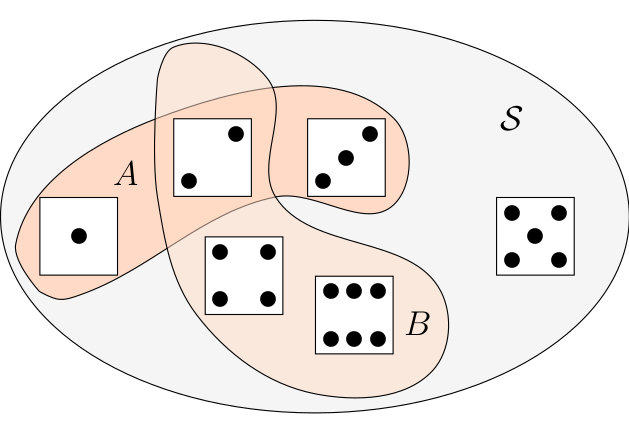
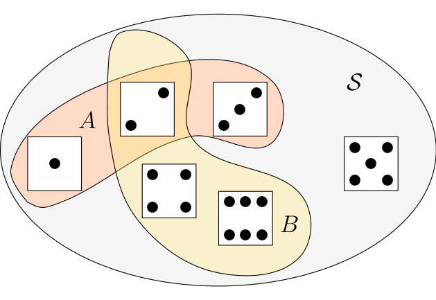
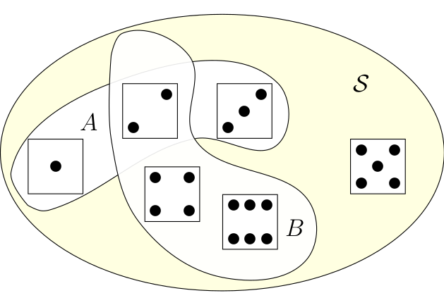

# Probability: Basic Definitions and Rules

## Probability in theory and applications of probability

Now that we have introduced the concepts of a random experiment, sample space, 
events and basic outcomes, we
can finally proceed to introduce the notion of *probability*. From the preceding 
lecture it should be
clear that we always speak of probability in relation to a given sample space or 
a conceptual random
experiment.

In lecture 1 we said that *probability* is a measure of how likely an event of an experiment is. 
Probabilities are expressed as numbers. As observed in Feller (p. 19), these numbers are of the same
nature as distances in geometry. In the theory we assume they are given to us. We need not assume
anything about how they are measured. In actual applications, the determination of probabilities
or the application of the theory to observations requires often sophisticated statistical methods. 
So, while the mathematical as well as the intuitive meaning of probability are clear only
as we proceed with the theory we will get a better ability to see how we can apply this concept.

## Basic rules of probability

When we talk of probabilities in this lecture we mostly consider probabilities with relation
to a *discrete* sample space.  The simple sample spaces we considered in lecture 1 contain only a
finite number of points. Such sample spaces belong to the discrete sample spaces. 

There are also more
complicated discrete sample spaces: Think of the random experiment of tossing a coin as often as 
necessary to see Heads for the first time. We can begin writing down the basic outcomes as:
$E_1=H, E_2=TH, E_3 = TTH, E_4 = TTTH, ...$. We may consider it possible that Head never appears. This
event we should perhaps call $E_0$. In this case, when the basic events can be arranged into a simple sequence.
A sample space is called *discrete* if it contains only finitely many points, or infinitely many
points which can be arranged into a simple sequence. 

Not all sample spaces are discrete. 
Except for the
technical tools required there is no essential difference between the two cases. In our discussion
of probability in this lecture we consider mostly discrete sample spaces.

Given a (discrete) sample space ${\cal S}$ the probabilities assigned to events in this sample
space must always fulfill three rules:


1. $P({\cal S}) = 1$, where ${\cal S}$ is the sample space.
2. For any event $A \in {\cal S}$,  $0 \leq P(A) \leq 1$. The probability of an event can never be
negative or larger than 1.
3. The probability of the union of two events $A$ and $B$ is always smaller or equal to the sum of the
probability of these events looked at in isolation: $P(A \cup B) \leq P(A) + P(B)$.

In the theory of probability we use the language of sets and set theory to 
describe relations among event.
We have used one of these relations in rule three, where we expressed the relation between two sets
as their union $\cup$. It is useful in studying probability
to know a few of these set theoretic definitions.

Let's go through them and illustrate the concepts in the context of the 
examples we have already developed 
in lecture 1.

Union
: The **union of two events** $A$ and $B$ is the set that contains all events that are either in $A$ or in $B$
or in both sets. Set union is written as $A \cup B$.

Let us use the example of the experiment of rolling a die. The sample space ${\cal S}$ is
the set of all possible outcomes of rolling the dice ${\cal S}=\{1,2,3,4,5,6\}$. Assume one
event is that the outcome is 1, 2 or 3. In set notation, we would write $A = \{1,2,3\}$. Let us 
also assume that the second event is that the outcome is some even number, i.e. 2, 4, 6. Again
using set notation we would write $B = \{2,4,6\}$. The event $A \cup B$ is then the set of all
outcomes such that the outcome is in A or in B or in both or these sets. In such simple examples
it is sometimes helpful to depict the situation graphically.
```{r set-union, out.width='80%', fig.align='center', fig.cap='The meaning of set union', echo = F}

```
The sample space ${\cal S}$ is the gray set containing all possible outcomes of our
random experiment. Graphically the union of $A$ and $B$, $A \cup B$ is a subset of
the sample space, the entire colored area. 

By the way: R provides functions for
computing set operations. Let us use the occasion to show you briefly how to use these functions
in the context of this example: We define the sets $A$ and $B$ first using the assignment operator:

```{r}
A <- c(1,2,3)
B <- c(2,4,6)
```

We compute the union by using the function `union()`

```{r}
union(A,B)
```
which gives us the result we have already derived graphically.


Intersection
: The **intersection of two events** is the set that contains all events that are both in $A$ and in $B$.
Set intersection is written as $A \cap B$.

We can again illustrate this concept graphically
```{r set-intersection, out.width='80%', fig.align='center', fig.cap='The meaning of set intersection', echo = F}


```
The intersection of $A$ and $B$, $A \cap B$ is the orange area containing the dice face with two
points. Indeed two is both in $A$ and in $B$, which is exactly the meaning of set intersection.

The R function for computing intersections is called `intersect()`. We call this function for
our example
```{r}
intersect(A,B)
```

which gives us the result we have already derived graphically. 

Complement
: The **complement** of an event $A$ with respect to an event $B$ is the set 
of all elements that are in $B$ but not in $A$. Set difference is written as $A \setminus B$.

Lets say we want to get the complement, or the set difference of $A \cup B$ with respect to the
sample space ${\cal S}$. Let us show ${\cal S} \setminus (A \cup B)$.
```{r set-minus, out.width='80%', fig.align='center', fig.cap='The meaning of set intersection', echo = F}

```
This complement is the dice shown in the light yellow area, i.e. all the elements of ${\cal S}$ 
which are not in $A \cup B$. 

The R function for computing set complements is called `setdiff()`. You can try it with our
example:

```{r}
S <- c(1,2,3,4,5,6)

setdiff(S, union(A,B))
```
which is 5, as expected.

Mutually Exclusive
: Two events $A$ and $B$ are said to be **mutually exclusive** if they have no 
basic outcomes in common. The
notation is $A \cap B = \emptyset$

An example in our context is the set of even outcomes $B=\{2,4,6\}$ and the set of 
odd outcomes, let us call it $C=\{1,3,5\}$. If we intersect these sets
```{r}
B <- c(2,4,6)
C <- c(1,3,5)

intersect(B,C)

```
we get the empty set, which is expressed by R by giving the data type, in this 
case numeric, because we are intersecting sets of numeric values, followed by (0). This means,
there is no numeric value in the intersection of $B$ and $C$.

Let us discuss probability rule 3 a bit further: Go to the picture we drew to 
illustrate the meaning of set union \@ref(fig:set-union). To compute the probability $P(A \cup B)$
we have to add the probabilities of all sample points that are contained either in $A$ or in $B$
but each point is to be counted only once. Therefore, probability rule 3, has a (weak) 
inequality: $P(A \cup B) \leq P(A) + P(B)$.

Now let $E$ be a point contained both in $A$ and in $B$, in our example this would be $E = \{2\}$,
then $P(E)$ occurs twice on the right hand side of our inequality but only once on the left.
Therefor the right hand side exceeds the left by the amount $P(A \cap B$). Thus we have
$P(A \cup B) = P(A) + P(B) - P(A \cap B)$.

This reasoning holds for arbitrary pairs of events and not only in our example. In the
case $A$ and $B$ are arbitrary events and $A$ and $B$ are mutually exclusive, 
i.e. $A \cap B = \emptyset$ then our inequality in rule 3 becomes an equality and we have
$P(A \cup B) = P(A) + P(B)$.

## Interpretations of Probability

While rule 1 - 3 pins down three basic mathematical properties of probabilities, there is an
ongoing and still unsettled debate what probabilities actually mean. While in this course we
will be less concerned with this philosophical question, it is so important that you 
should hear about
the basic interpretations at least once.

Probability theory took shape in the 17th century through discussions on the mathematics of
games of chance, such as poker or roulette or games where dice are rolled. In this
stage the *classical* meaning of probability was the ratio of outcomes that satisfy a condition
or the description of an event divided by the total number of outcomes in the state space. Of
course this interpretation of probability makes the implicit assumption that all outcomes
have the same probability. For example, in this interpretation the probability that one role
of a dice will result in a $6$ is $1/6$. This interpretation is often called 
*classical probability*.

A more important interpretation is the interpretation of probability as *relative frequency*.
In this interpretation the probability of an event $A$ is interpreted as the number of times
the event $A$ occurs in repeated trials divided by the total number of trials in a 
random experiment.

A competing interpretation of probability is called *subjective probability*. In this
interpretation probability is an opinion or a belief about how likely the occurence of
a particular event is.

## Example continued

### The stock price of Apple

Let us go back to our example with the stock price of Apple. In this example we had expressed
the state space as ${\cal S}=\{U, D\}$. It is however impossible to determine the probability
for each of these two elements. It is also not possible to determine the probability
for each price which is theoretically possible.

### Tossing a fair coin twice

Assume we toss a fair coin twice and that the two possible outcomes 
of this random experiment is that the coin comes up heads $H$ or tails $T$. 
The state space of the random experiment of tossing a coin twice is
${\cal S} = \{HH, HT, TH, TT\}$. We can now ask: What is the probability of getting H 
after the first toss? Since the coin is assumed to be a fair coin each outcome of
the toss is equally likely. The probability of getting H after the first toss, must
therefore be $1/2$. Now we could ask: What is the probability that we get H after the second
toss as well? If you think about the situation, you will see that the probability of
getting H in the second toss is completely unaffected by what happened after the first toss. 
This probability is independent of the outcome of the first toss and since the coin is 
a fair coin it is also equally likely to get H as it is to get T. The probability of getting
H after the first toss is therefore again $1/2$.

Here we derived the equal probability postulate by an assumption, interpreting
the probability as a classical probability. 

We could also give this postulate a frequency
interpretation using our knowledge of R.

We proceed by analogy to our approach of rolling a die. Let us
therefore create a virtual coin first.

```{r}
coin <- c("H", "T")
```

As in the case of the die we next write a function, so we can virtually toss the coin

```{r}
toss_coin <- function(){coin <- c("H", "T")
                        sample(coin, size = 1) }
```

Now lets toss this coin 100 times by using the `replicate` function and 
save the result in an object called 
tosses_100:

```{r}
tosses_100 <- replicate(100, toss_coin())
```

Lets look at the outcome of the 100 tosses graphically

```{r}
qplot(tosses_100)
```
The histogram shows that the occurrence of Heads and Tails are almost 50/50 but not 
exactly. Lets toss 1000 times and then look again.

```{r}
tosses_1000 <- replicate(1000, toss_coin())
qplot(tosses_1000)
```
This looks already pretty good. Lets toss even more. Why not toss a million of times?

```{r}
tosses_m <- replicate(10^6, toss_coin())
qplot(tosses_m)
```
Now you see the idea of the frequency interpretation. The number of occurrences of H divided
by the total number of tosses comes closer to the $1/2$ probability as we toss many
times. We will come back to this idea again a bit later.

### Boys and Girls

We have introduced the four child family before in lecture 1 and asked you to figure out the
state space of the random experiment how the sequences of boys and girls might result in this
four children outcome.

If you have correctly figured out the state space, you will surely be able to 
tell which of the 
following sequences is more likely i.e. has the higher probability: `bbbb`, `bgbg` or
`gggg`?

Let's use the idea we considered first in coin tossing, and use the `expand.grid()` function
to figure out all combinations of boys and girls in a family of four kids. The outcome
of the sex of a baby at any of the four births is abstractly the same as a coin toss with
the possible outcomes: `b` or `g`.

```{r}
birth_1 <- c("b", "g")
birth_2 <- c("b", "g")
birth_3 <- c("b", "g")
birth_4 <- c("b", "g")
```

Now we can let R figure out all possible sequences of outcomes. We store the outcome in an
object called n and count the combinations using the R function `nrow()` which counts the
number of rows of a so called dataframe, a structure we discuss in detail in a minute.

```{r}
n <- expand.grid(birth_1, birth_2, birth_3, birth_4)
nrow(n)
```

There are 16 combinations in total. Applying the same reasoning as with the coin tossing
example, we see that the probability of each sequence should be equal to $1/16$. 

In reality
by the way births are slightly more likely for boys than girls. Gelman and Nolan report for
example the US numbers for the year 1981, where 1 769 000 girls were born, while there
were 1 860 000 boys: $48.7 \%$ of births were thus girls.

Let us come to our last example,illustrating the interpretation of
probability as subjective probability.

### Example: FinTech Start Up

Suppose you had a great idea for a path breaking FinTech innovation, which will disrupt
the banking landscape. To predict the success of this innovation in probabilistic terms
you could only use a subjective probability. There are no data you can rely on, since this
idea had not existed before. You can only rely on your experience and your belief in
your idea. There is no way you could use a classical or a relative frequency 
interpretation of probability.

## Independence

Let us go back to our fair die and ask another probability question about the
potential outcomes of rolling the die: What is the probability that a fair six sided die
will roll a 5 and then a 6? 

Note that this is a question, slightly different from what
we have asked before. What we need to calculate is actually the probability of
the event that the dice shows first 5 and then 6, i.e. we need to compute
$P(5 \cap 6)$. We can multiply the individual probabilities because the subsequent rolls of 
the die are independent: 
$P(5 \cap 6) = P(5) \cdot P(6) = \frac{1}{6} \cdot \frac{1}{6} = \frac{1}{36}$.

Indeed we have the following definition:

Independence
: Two events $A$ and $B$ are **independent** if an only if the probability of
both $A$ and $B$ occurring is the product of the probability of the two events
$P(A \cap B) = P(A) \cdot P(B)$.

### Example: The Apple stock price again

Let us go back to our Apple stock price data, we have used previously. We read the
data again from our data folder.

```{r}
apple_stock <- readRDS("data/apple_stock_price.RDS")
```

Our data store price information about 150 trading days. During these dates, as you can
convince yourself, the price went up on 72 days and it went down on 77 days. It didn't 
stay the same at any day. We get in total 149 counts because we need to drop one observation
to compute the changes in the price.

Now let us assume that the probability of a future up movement is $P(U) = \frac{72}{149}$, which
is about $0.48$ and the probability of a down movement is $P(D) = \frac{77}{149}$, which is
about $0.52$.

Now assume in addition that the performance of the Apple stock price on the current trading day is
independent of the performance of the Apple stock price on previous trading days. This means
that the probability of $U$-movements and of $D$-movements is unaffected by the number of
previous $U$ and $D$ movements. This is - of course - an assumption. You may think about
whether this assumption is reasonable.

Now let us consider a week from Monday to Friday: 


- What is the probability that the price of
Apple will increase on each of the consecutive days? 

There are five trading days, so we need to compute
$P(U \cap U \cap U \cap U \cap U \cap U)$. This is by our assumption of independence equal
to $P(U) \cdot P(U) \cdot P(U) \cdot P(U) \cdot P(U)$. By our probability estimate from
relative frequency this amounts to $0.48^5$, which amounts to $0.025$.

- What is the probability that the stock price will decrease either on Monday, Tuesday, Wednesday, Thursday or Friday and will increase on the other four days?

The probability that the $D$ movement happens, say on a Monday, is 
$P(D \cap U \cap U \cap U \cap U)$ or $0.52*0.48^4$ which is $0.028$.
We have in total five mutually exclusive scenarios:
$P(D \cap U \cap U \cap U \cap U)$, $P(U \cap D \cap U \cap U \cap U)$, 
$P(U \cap U \cap D \cap U \cap U)$, $P(U \cap U \cap U \cap D \cap U)$,
$P(U \cap U \cap U \cap U \cap D)$. Thus we have $0.028 + 0.028 + 0.028 + 0.028 + 0.028$
as the final probability of this event, which is $0.14$.

## Analyzing the stock price of Apple: More R concepts

By discussing some probability concepts within the context of stock price movements we looked
at the Apple stock price data. R gives us some powerful tools to work with such data
and they provide a very good example to teach you some more things about R.