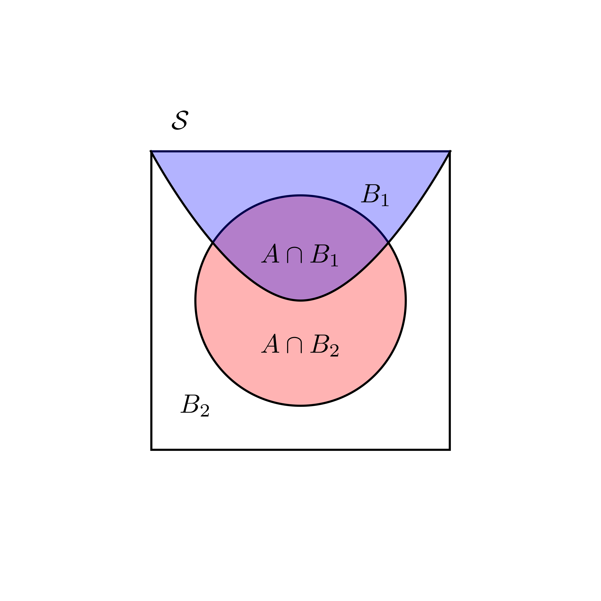
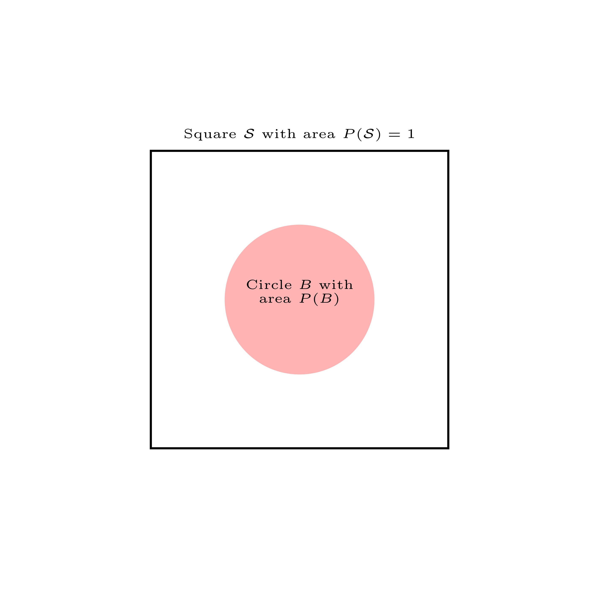
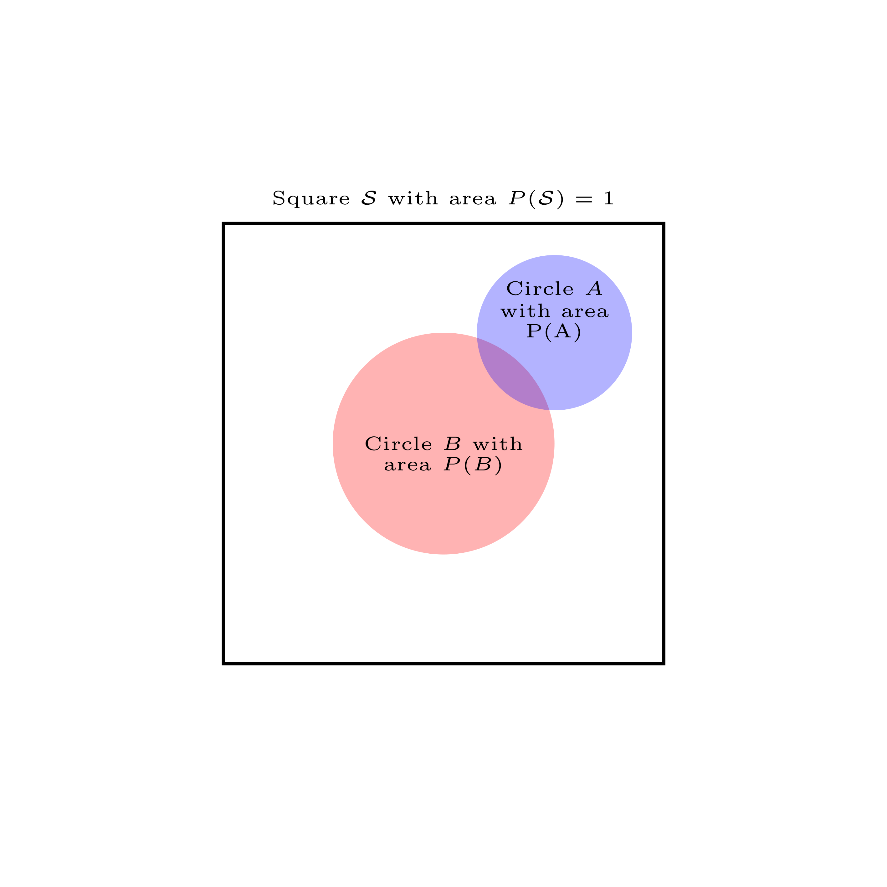
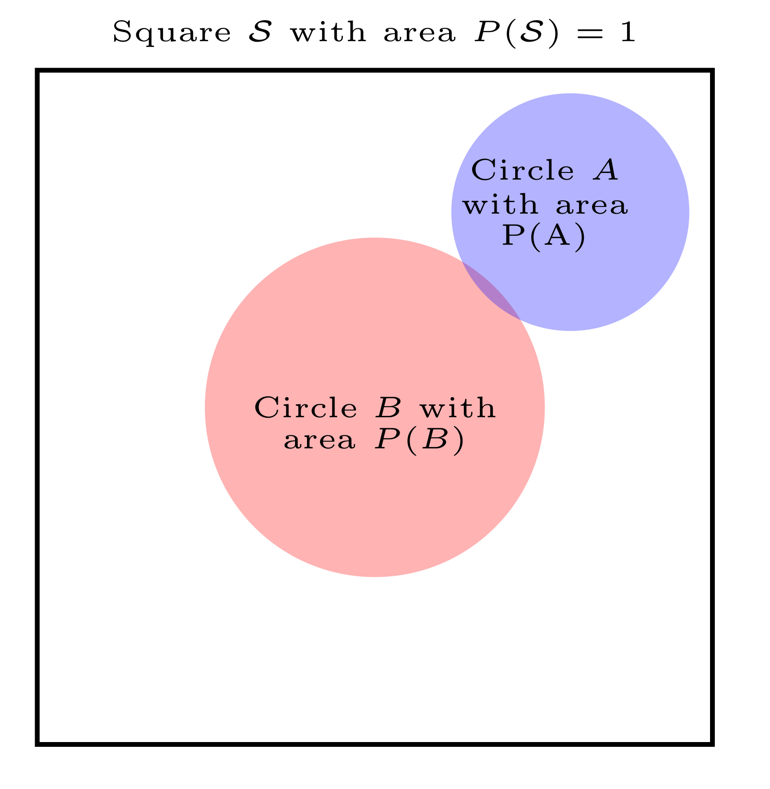
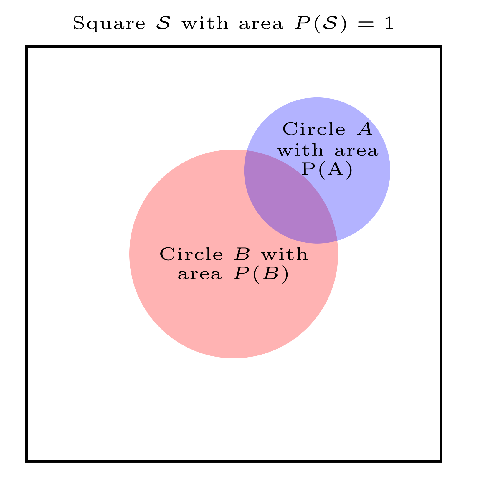
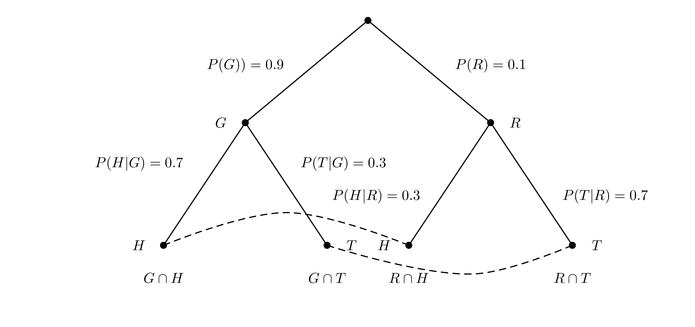

# Conditional Probability

## Contingency tables

We begin this lecture with a definition and an example. Here is the definition:

Contingency Table
: A contingency table shows counts of cases on one categorical variable contingent
on the value of another for every combination of both variables.

Contingency tables are useful for calculating **conditional probabilities** as they
contain all the necessary ingredients for the computation. The concept of
conditional probability and its applications
will be the main contents of this lecture.

Let us start with an example of a **contingency table** within the context
of stock price moves, we discussed already in lecture 2. 
It gives me also an opportunity to point you to one
powerful R package, which will allow you to access financial data, quite easily for
yourself without me providing them to you with study material: The
`tidyquant-package`. You can check out the packages's home page with documentation and
study material at: https://business-science.github.io/tidyquant/.

Remember from lecture 1 that we can install add-on packages for R, which extend the
functionality of the system by new functions. A packages has to be installed first and then
loaded into working memory. To install tidyquant let us first use the install command:
`install.packages("tidyquant")` 
and then load the package by `library(tidyquant)`:
```{r  load-tidyquant, include = F}
library(tidyquant)
```

We do not go into the tidyquant package in any detail. If you are interested
check out the github page cited above. For now we only show the
use of one of its core functions which allows you to load financial data directly
from the internet. 

This function is called `tq_get()`. Let's see how it works. We first
retrieve the S&P500 stock market index. To do this we need to know the ticker symbol, which is
`^GSPC`. This has to be passed to the `tq_get()` function and that's it. Let us save these 
data into an R object, which I call `sp500`and look at the first entries
```{r load-sp-500}
sp500 <- tq_get("^GSPC", from = " 2011-01-03")
head(sp500, n = 5)
```
We see that the series starts at the first of March 2011 and contains daily observations of 
various variables.
Now let's retrieve the stock price data of 
Apple beginning at 2011-01-03, the same day as the index data. We know from the
last lecture that the ticker symbol for Apple os `AAPL`. This means we can use the command:
```{r read-others}
apple <- tq_get("AAPL", from = " 2011-01-03")
```
You can give a beginning date to the argument `from` in the `tq_get()` function (you can guess 
that you can also give an end data `to` as an argument to `tq_get`)

For the contingency table we would like to count the number of days when the
S&P was moving up from one day to the next and how often it was moving down. We would
like to do the same with the Apple stock price.

As discussed in lecture 2, one way to see whether the price 
moved up or down from one day to the next is to
compute the daily price differences in  the closing price. When this difference is
positive the price made an up movement, when it is negative, it made a down movement (it
could theoretically also not change at all).

There are many ways to implement such a computation in R. Let me remind
you of the `diff()` function, we already used in lecture 2. It implements a method for
computing differences in time series. Consider the following example: Say we have
a vector of values like
```{r}
val <- c(2,4,7,1,9,10)
```
and we apply the `diff()`function we will get
```{r}
diff(val)
```

Now, of course by taking differences between 4 and 2, 7 and 4, 1 and 7, 9 and 1, ans 10 and 9 we
have to drop the first observation and get a vector which is shorter than `val` by one component.
We can
produce a vector of equal length if we add as the first component the value NA, which is
R's symbol of "not available" or of a missing value. Indeed this makes sense because for the
first date if you want we have no value for the change (since we cut off there and don't know
the value from the day before).

Now let us apply this reasoning to the Standard and Poors 500: The data of the index are in a
data frame. We can add a column to this data frame by the $ symbol followed by the
column name. This
symbol will append a new column with the name we write after $. Let us call this new
column "changes" and compute the changes in the closing price by the `diff()`function.
Now, since we loose the first value here by taking the first difference, let us
replace it by NA and from a new column of price differences with the first observation
replace by NA. Thus we type:

```{r changes-sp500}
sp500$changes <- c(NA, diff(sp500$close))
```
Lets do the same for the Apple stock price. 
```{r}
apple$changes <- c(NA, diff(apple$close))
```
Note that I did not specify the `lag` argument in the `diff()`function. This i can do
because the `lag`argument is set to a value of 1 by default, and this is the value I
just need now, because we are looking for daily changes.

Let me use this opportunity to introduce you to how R treats missing information. This is
a situation you will encounter all over in applied work with data in general and with 
financial data in particular.

`NA` in R is an indicator for missing values. It is formally a logical 
constant of length 1 and means "not available". It can be used as
a placeholder for missing information, just as we did before, where we inserted `NA` in the 
column of price changes for the first record, where we could no compute the difference, since
we had no information on the price the day before our data set starts. `NA` is treated by R
exactly as you would expect that missing information should be treated. If you use it in
arithmetic operations or in comparisons, you will be returned `NA`. 

`NA` prevents you from mistakes made due to missing information. It can also 
create practical problems. If you would for instance try to compute the 
average price change of the apple
stock price
```{r treatment-of-na}
mean(apple$changes)
```
This is, of course, annoying. Just because there is one `NA` at the beginning of more than 2700
records, you should still be able to compute the mean. You just need to drop the `NA`. R has
an argument to most statistical functions, which allow you to drop the `NA` before you do the
computation, `na.rm`. When we set this argument to `TRUE` (or equivalently `T`), R is able
to do the computation:
```{r na-rm}
mean(apple$changes, na.rm = T)
```
Occasionally, you also want to identify or count the `NA` in your data with a logical test. For
this purpose R provides a special function `is.na()`. This function takes a value and checks
whether it is an `NA`. Say, for example, we have the vector:
```{r is-na}
vec <- c(1, NA, 2, 3, NA)
```
and then apply:
```{r test-na}
is.na(vec)
```
we get a vector of logical values. This vector would allow us then, by R's subsetting rules, to
select the non-NA values. We just tell R to select all elements from `vec` which are not `NA`:
```{r subset-logical-vec}
vec[!is.na(vec)]
```
This end our short digression into the treatment of missing information in R.^[For numerical
vectors R also has the symbol NaN. NaN stands for Not A Number and is a logical 
vector of a length 1 and applies to numerical values, as well as real and 
imaginary parts of complex values, but not to values of integer vector. NaN is a reserved word.
These symbols have to be distinguished from NULL, which is an object and is returned 
when an expression or function results in an undefined value. In R 
language, NULL (capital letters) is a reserved word and can also be the 
product of importing data with unknown data type.]

Let us now count the up moves and the down moves in the index and in the
Apple stock. Since there are only these two outcomes
it is sufficient if we add a logical column to both dataframes, checking the condition that
the change variable is larger than zero (note that with this test we automatically would
count the possible cases where the stock price remains unchanged to the down movements).
```{r joint-ups}
sp500$up <- (sp500$changes > 0)
apple$up <- (apple$changes > 0)
```
We can now tabulate the joint up and down moves using the `table()` function. We give the
`dnn` argument to the function, so we can see which are the dimensions in the table computation
R is performing for us. We also add the marginal sums by giving the output of the
`table` function to the `addmargins()` function of R:
```{r table}
addmargins(table(sp500$up, apple$up, dnn = c("SP500", "Apple")))
```
From this table you can read the total number of cases where it is true that
the SP500 index and the Apple stock price move 
up together, the number of cases when they fall together as well as
the number of cases where they move in opposite directions. The last row and 
the last column contain the row and column sums of all these cases.

So now we have used R to create a contingency table we can create ourselves concrete
manifestations of the abstract
definition we gave in the beginning. On the way you deepened and fortified your knowledge of 
R a bit further.

## Marginal, joint and conditional probability

Marginal probability
: The **marginal probability** is the unconditional probability of an event. This
probability is not conditioned on any other event. In terms of notation, we
denote the marginal probabilities of two arbitrary events $A$ and $B$ by
$P(A)$ and $P(B)$ respectively.

Joint probability
: The **joint probability** is the probability of simultaneous events. This is
the probability of the intersection of two or more events. If $A$ and $B$ are
arbitrary events, we write $P(A \cap B)$ for the joint probability of $A$ and $B$.

Conditional probability
: The **conditional probability** is the probability of an event *given* that some other
event has occurred. The information from the event that has occurred can influence
the probability of the original event. The following notation is used for
conditional probabilities: For two events $A$ and $B$, the conditional probability of
$A$ given $B$ is denoted by $P(A\,|\,B)$ and the conditional probability of $B$ given
$A$ is denoted as $P(B\, |\, A)$. In general these two conditional probabilities are
not the same.

The table of joint moves, we have computed before can help us to illustrate
these concepts using the frequency interpretation of probability: We divide 
each entry in our table by the total number of cases. Of course this is so frequent
a case in applied data analysis that R has a function for it, the `prop.table()` function:
```{r prop-table}
prop_table <- addmargins(
  prop.table(
    table(sp500$up, apple$up, dnn = c("SP500", "Apple"))
    )
  )
prop_table
```
The **marginal probability** that the SP500 will make an Up move is:
\begin{equation*}
P(\text{SP500-Up} \cap \text{Apple-Down}) + P(\text{SP500-Up} \cap \text{Apple-up}) = P(\text{SP500-Up})
\end{equation*}
which is
```{r marg.prob, echo = F}
round(prop_table[2,1] + prop_table[2,2], 2)
```
It is the sum
of the two **joint probabilities** $P(\text{SP500-Up} \cap \text{Apple-Down})$ and
$P(\text{SP500-Up} \cap \text{Apple-Up})$. 

To compute the conditional probability
that the stock price of Apple will make an up move given that the SP500 makes an
up move we have to compute $P(\text{Apple-Up} | \text{SP500-Up})$. The probability
that the Apple price went up and the SP500 went up is $P(\text{Apple-up} \cap \text{SP500-Up})$.

But given I already know that by the condition SP500 went up, I am in the second line of
my table and we know that the first line, SP500 went down - is ruled out by the
condition. 

We thus have now a *new sample space* and we must
adjust the probabilities proportionally
to be consistent with the rules of probability. We therefore have to divide by
$P(\text{SP500-Up})$ to get the formula
\begin{equation*}
P(\text{Apple-Up} | \text{SP500-Up}) = \frac{P(\text{Apple-up} \cap \text{SP500-Up})}{P(\text{SP500-Up})}
\end{equation*}
which is:
```{r cond-prob, echo = F}
round(prop_table[2,2]/prop_table[2,3],2)
```
To check whether we have made the correct re-normalisation you can ask yourself: Given the
rules of probability, what is $P(\text{Apple-Down} | \text{SP500-Up}))$ ? It should be 1 minus
the conditional probability that it goes up given the sp500 index goes up, which is
```{r, check-cond, echo = F}
1 - round(prop_table[2,2]/prop_table[2,3],2)
```
Applying the formula for conditional probability we would compute
\begin{equation*}
P(\text{Apple-Down} | \text{SP500-Up}) = \frac{P(\text{Apple-Down} \cap \text{SP500-Up})}{P(\text{SP500-Up})}
\end{equation*}
which is indeed
```{r cond-direct, echo = F}
round(prop_table[2,1]/prop_table[2,3],2)
```

Another way to think about this formula can perhaps help to foster our intuition if we
look at this problem through the frequency interpretation of probability:

We would like to
find the conditional probability that Apple makes an up move given that
SP500 makes an up move. Suppose the daily price moves are a conceptual
random experiment with the outcomes that the
price can either move up or down and we have two prices SP500 and Apple, so our
sample space has four possible outcomes:
${\cal S} = \{ UU, UD, DU, DD \}$ where the first character if it is U means SP500-Up
and the second if it is U means Apple-Up and so on for all possible combinations.
We repeat this
experiment 2752 times and keep a notebook where at every repetition we write down the
number of the experiment, the outcome and then we note whether both Apple and the SP500
went up.

| notebook line | outcome             | SP500-Up and Apple-Up ?|
|:-------------:|:-------------------:|:-----------------------:|
|1              |SP500-Up, Apple-Down | No                      |
|2              |SP500-Down, Apple-Up | No                      |
|3              |SP500-Up, Apple-Down | No
|4              |SP500-Up, Apple-Up   | Yes                     |
|.              |.                    |.                        |
|.              |.                    |.                        |
|.              |.                    |.                        |
|2752           |SP500-Up, Apple-Up   |Yes                      |

To get the conditional probability of a Apple-Up given an SP500-Up we have to count
the Apple-Ups **among the notebook lines** where the SP500 has an Up move and divide by
the number of these SP500-Up lines.

Let's do this in R. To create the notebook we make a data frame where one column is the Up column
of the SP500 data and the second columns is the Up column of the Apple data. We remove
all `NA` in the data frame: This is achieved by applying the function `na.omit()` to the data
frame. It will remove all `NA`.

This provides a nice opportunity to introduce you to a very useful operator, which is
included in base R and which is called the pipe. It is available, since R version 4.1.0 and
it's symbol is `|>`. It allows you to make code in which several functions are nested
more readable. The way it works is that you can use the pipe to send a line of code or the
output of a fucntion as input to another function. In our case we would first create a data frame
and then pipe the frame to `na.omit()` to finally save it in an object we call `joint_ups`:
```{r df-joint-ups}
joint_ups <- data.frame(SP500Up = sp500$up, AppleUp = apple$up) |>
  na.omit()
```
Before R 4.1.0 there was a pipe operator with this functionality available through the `magittr` package, where it had the symbol `%>%`. When you work with R you will encounter this version of
the pipe sooner or later.

Now we apply what we have already learned about referencing values in a data frame in R to
select all the row numbers in our fictitious notebook where the SP500 moves Up and look at the
first rows:

```{r select-joint-moves}
sel_joint <- joint_ups[joint_ups$SP500Up == TRUE, ]
head(sel_joint, n = 5)
```
To count the number of rows we can use the `nrow()` function.
```{r count-rows-joint}
nrow(sel_joint)
```

It says that the number of notebook lines where the SP500 makes an Up move is
```{r exemplify-rjoint-number, echo = F}
nrow(sel_joint)
```
The result
should not surprise us, for we already derived it using the contingency table.


Now, let us count the Ups in the Apple price occurring simultaneously with the SP500 ups. Here we
use the logical operator `&` which is R's syntax for the set symbol $\cap$:

```{r}
joint_ups$simultaneous = (joint_ups$SP500Up & joint_ups$AppleUp)
```

Now we can make use of R's coercion rules to count the simultaneous up moves

```{r}
sum(joint_ups$simultaneous)
```

Now we compute the relative frequency of joint up moves among all the lines where
the SP500 moves up, which is
```{r notebook-approach, echo = F}
round(sum(joint_ups$simultaneous)/dim(sel_joint)[1], 2)
```
as we have indeed derived before using the contingency table.

Let us finally use a picture to explain the concept graphically once again.
```{r cond-probability-visualized, out.width='90%', fig.align='center', fig.cap='A Visualization of conditional probability ', echo = F}
knitr::include_graphics('figures/cond_prob.png')
```
On the left you see the sample space symbolized as a square and the area of event $B$, SP500-up,
is the proportion of the whole sample space taken up by this event, whereas event $A$, Apple-up 
is the proportion of the *whole* sample space taken up by this event. When it is known 
that $B$ has occurred, the sample space changes and the event that both, SP500-up and Apple-up
is in the intersection of both areas and the conditional probability is the area of this
intersection as a proportion of $B$. On the right you see a picture of our notebook metaphor using
the same color codes. The conditional probability is the ratio of all violet stripes as a
proportion of all blue stripes.

We now can give the

Formal definition of conditional probability
: Let $A$ and $B$ be given events. We define the **conditional probability** of $A$ given $B$
as
\begin{equation*}
P(A\,|\,B) = \frac{P(A \cap B)}{P(B)}\,\,\, \text{provided}\,\,\, P(B) \neq 0
\end{equation*}

Note that for conditional probabilities we have for two events $A$ and $B$, that
$P(A|B) \neq P(B|A)$.
To see this assume that $P(A) \neq P(B)$ and $P(A) \neq 0$ and
$P(B)\neq 0$. 

We then get:
\begin{equation*}
P(A|B) = \frac{P(A\cap B)}{P(B)} = \frac{P(B \cap A)}{P(B)}
\end{equation*}
since $P(A \cap B) = P(B \cap A)$.
It follows that
\begin{equation*}
\frac{P(B \cap A)}{P(B)} \neq \frac{P(B \cap A)}{P(A)} = P(B|A)
\end{equation*}
since we
have assumed that $P(A) \neq P(B)$. 
Therefore $P(A|B) \neq P(B|A)$.
You can check this with the stock example, we discussed before.

## The multiplication rule

The following formula is often called the **multiplication rule** and is just a
rewritten form of the definition of conditional probability.

Multiplication rule
: Given events $A$ and $B$ it holds that
\begin{equation*}
P(A \cap B) = P(A | B)\times P(B)
\end{equation*}

The multiplication rule can give us a deeper insight into the notion of
independence, we discussed earlier. Remember that two events $A$ and $B$ are independent
if $P(A \cap B) = P(B \cap A) = P(A) \times P(B)$. 

If we combine this rule with the
concept of conditional probability, we see that if two events $A$ and $B$ are independent, then
\begin{equation*}
P(A|B) = \frac{P(A \cap B)}{P(B)} = \frac{P(A) \times P(B)}{P(B)} = P(A)
\end{equation*}
and
\begin{equation*}
P(B|A) = \frac{P(B \cap A)}{P(A)} = \frac{P(A) \times P(B)}{P(A)} = P(B)
\end{equation*}

This formula says that if two events are independent the probability of $A$ is
not influenced by the event $B$ occurring and the probability of event $B$ is not
influenced by the event $A$ occurring.

## Law of total probability

The multiplication rule implies a further rule, which is often called the **law of total probability** in the literature. We state the law for a simple case for two disjoint
events, which can be
generalized in a straightforward way to $N$ disjoint events.

Law of total probability
: Suppose the sample space ${\cal S }$ is divided into two disjoint events $B_1$ and $B_2$, 
which cover the sample space then
for any event $A$ we have
\begin{align}
P(A)&= P(A\cap B_1) + P(A\cap B_2)\\
    &=P(A|B_1)P(B_1) + P(A|B_2)P(B_2)
\end{align}
Such covers of disjoint sets are called a **partition** of the sample space. It can 
abstractly be visualized as
follows:
```{r total-probability-visualized, out.width='90%', fig.align='center', fig.cap='A Visualization of total probability ', echo = F}


```
Note that in this picture $B_1 \cap B_2 = \emptyset$ and $B_1 \cup B_2 = {\cal S}$, hence $B_1$ and
$B_2$ form a partition of the sample space. The probability of $A$, the red set can then be
determined by the law of total probability.

As an **example**, consider a stock analysis problem, where you learn that a company is planning
to launch a new project that is likely to affect the companies stock price. There is a $60 \%$
probability that a project will be launched. If this happens there is $75 \%$ probability
that the stock price will increase. In case the project is not launced this probability is
only $30 \%$.

You might think of this situation in terms of a contingency table:

|                       |  Launch Project| Don't Launch Project|        |
|:----------------------|---------------:|--------------------:|-------:|
|Stock price rise       |  0.45          | 0.12                |  0.57  |        
|Stock price not rising |  0.15          | 0.28                |  0.43  |                 ´        
|Total                  |  0.6           | 0.4                 |  1     |      

Say we want to assess the probability that the stock price will rise, given these
data. Then we can apply the law of total probability is: $0.45 + 0.12 = 0.57$.

## Example: Independence and the Financial Crisis of 2007-2008

In this example, we will go back to the financial crisis of 2007-2008, in which the
global financial system almost completely collapsed. While the history 
of the crisis as well as the institutional details of structured Finance are
very complicated, a conceptual root problem of structured finance and the crisis
has a lot to do with the proper conceptual understanding of the
concept of conditional probabilities and independence. Let's see why.

To set the stage we need some background from Finance first. We begin with the
definition of a **bond**.

Bond, face value, par value
: A **bond** is an obligation by a bond issuer to pay money to the bond-holder according
to the rules specified at the time the bond is issued. Generally, a bond pays a specific amount,
its **face value** or equivalently its **par value** at the date of maturity.

Bonds are the biggest and most liquid class of fixed-income securities and have tremendous
practical importance as investment vehicles. The details are very involved and we ignore them
here.

Although bonds offer a fixed-income stream, they are subject to default, if the issuer has
financial difficulties or gets into bankruptcy. So there is a certain credit risk in bonds.

To characterize the nature of these risks bonds are usually **rated** by rating organisations. The
two primary ratings are issued and published by Moody's and Standard and Poor's. 

Bonds that are either high or medium grade are considered to be **investment grade**. Bonds
that are below the speculative category are often called **junk bonds**. The rating is 
usually based on a statistical analysis of various financial ratios of the issuer, such as 
leverage, debt to equity, cash flow to outstanding debt etc. Bonds with a lower rating
will have a higher probability of default and 
a lower price than a comparable bond with a higher rating. The following table
shows the rating schemes of Moody's and Standard and Poor's.

|                  |  Moody's| Standard & Poor's | 
|:-----------------|--------:|------------------:|
|High grade        | Aaa     | AAA               |
|                  | Aa      | AA                |
|Medium grade      | A       | A                 |
|                  | Baa     | BBB               |
| Speculative grade| Ba      | BB                |
|                  | B       | B                 |
| Default Danger   | Caa     | CCC               |
|                  |Ca       | CC                |
|                  |C        |C                  |
|                  |         | D                 | 


In the early 2000's financial innovations came to the market that proposed the practice 
of **pooling** and **tranching** bonds to transform the risks of junk 
bonds in a way that some good risk bonds as well as some even
more risky junk bonds are created by the process. An important asset class created by these
financial engineering techniques were **mortgage backed securities**.

Let us explain the idea. Let's imagine a bond that is issued today - at $t = 0$ - and
matures in a year from now, tomorrow, at $t = 1$. It pays off $1$ euro at maturity, but
there is a certain risk of a default, in which case it pays nothing or $0$. 

You might imagine this bond as an event tree. Since it is a junk bond, this default happens
with probability $P(\text{default}) = 0.1$. 
```{r simple-tree, out.width='90%', fig.align='center', fig.cap='A simple event tree for a defaultable bond', echo = F}
knitr::include_graphics('figures/simple_tree_one_bond.png')

```
Lets assume now that we have two junk bonds of this kind. Now the sample space is bigger than
before. Since we have two possible outcomes for each of two bonds, we are in a similar 
situation as when we toss a fair coin twice. The sample space is now ${\cal S} = \{ B^1_D B^2_D,
B^1_D B^2_N, B^1_N B^2_D, B^1_N B^2_N \}$. Let's try to visualize this situation also in a tree.
```{r two-stage-tree, out.width='90%', fig.align='center', fig.cap='An event tree for two defaultable bond with independent defaut probabilities', echo = F}
knitr::include_graphics('figures/double_tree_two_bonds.png')

```
The tree is interpreted as follows: Each dot is called a **node**. The tree is organized
by levels, the top node or **root** being level 0. The next layer is layer 1 and so on. 
The tree might symbolize a sequence with one layer happening before the other, or here
in our case a simultaneous event of two bonds reaching their state at $t=1$. 

Probabilities are written along the edges of the tree. The probability of $B^1_N$ - the probability
that the first bond dies not default - is $0.9$. It is written on the edge from the root
to the node labeled $B^1_N$. At the next level we put the **conditional** probabilities. The
edge from $B^1_N$ to $B^2_N$ is $P(B^2_N\,|\, B^1_N)$. By the multiplication rule the
probability of getting to any node is just the product of the probabilities along the edges.
\begin{equation*}
P(B^1_N \cap B^2_N) = P(B^1_N) \times P(B^2_N\,|\, B^1_N)
\end{equation*}
Now if we assume that the risks are **independent** this would just be
\begin{equation*}
P(B^1_N \cap B^2_N) = P(B^1_N) \times P(B^2_N) = 0.9 \times 0.9 = 0.81
\end{equation*}
You can work out all the other probabilities now for yourself.
At the end nodes of the tree, I have written the event symbolized by the end node in
set notation. Between the dashed lines you can read off the 
payoffs of the two bonds if we go along the
edges of the particular path below the end nodes. The payoff of $B^1$ is written above 
the payoff of $B^2$. Below the lower dashed line I have written the *aggregate* payoff 
of both bonds or the sum of their individual payoffs.

The law of total probability can also be illustrated nicely in this tree picture. For
example $P(B^2_D)$ is just the sum of all probabilities of the paths, leading to $B^2_D$ which
is given the current tree just 
$0.9 \times 0.1  + 0.1 \times  0.1  = 0.1$.

Some of you might have realized that the tree gives us an equivalent representation to what
we would have got from a contingency table. To see this, look at:

|                  |  $B^2_D$| $B^2_N$ | 
|:-----------------|--------:|--------:|-----:|
|$B^1_D$           | 0.01    | 0.09    |0.1          
|$B^1_N$           | 0.09    | 0.81    |0.9          
|Total             | 0.1     | 0.9     |  1         

Now you need to be prepared for a piece of financial magic, which we perform by
applying the concepts of **pooling** and **tranching**. We put the two (junk) bonds
into a pool or a portfolio to create two new bonds out of them by contractually altering
the payoff structure. Let us call these bonds $I$ and $J$ for investment grade and junk.
But how is this possible, can we really take two junk bonds as an input and rearrange
their payoff to get an investment grade and something else? Here is how
```{r two-stage-tree-pooled, out.width='90%', fig.align='center', fig.cap='An event tree for two synthetic bonds built on the junk bonds $B^1$ and $B^2$ with independent defaut probabilities', echo = F}
knitr::include_graphics('figures/pool_and_tranch.png')

```
What we see here is a slightly modified tree for the two new bonds $I$ and $J$. Their payoff is
engineered from the underlying junk bonds $B^1$ and $B^2$. So $I$ and $J$ get different 
payoff profiles but in such a way that they can be funded from the aggregate cash flow of both
of the junk bonds. Note that
below the dashed line you see that the sum of payoffs did no change. So when we *pool* the
initial two junk bonds and *tranch* them into the two new payoff structures, we can fulfill
all promises from the cash flow of the pool. 

Here is the magic: $I$ is a bond that pays in all states, except when both $B^1$ and $B^2$ default.
Under the assumption of independence, the probability of such a state occurring is just $0.01$. 
Thus, given the independence assumption both Moody's and Standard and Poor's could now grade 
the new bond as investment grade. The other bond $J$ now never pays off except in the state where
both $B^1$ and $B^2$ would both not default. It defaults, thus with probability $0.99$. It has 
become toxic junk. 

Thus here we have the magic of structured finance at work: We took junk plus 
junk and got investment grade and toxic junk. Now, note that this is toy example. But 
essentially this is what has been used in real life situations at an enormous scale. 
This repackaging game was played as a trillion dollar 
business, mainly with mortgages but also with other security classes, like 
car loans, student loans and credit card debt. 
Special investment vehicles
sponsored by banks would pool and tranch the various asset classes, 
rating agencies would rate them and investors hungry for safe
investments would buy the synthetic investment grade bonds.

But what would happen, if independence does **not** hold and our risks are **dependent** instead? 
Contemplating this possibility is not very far fetched. After all, if a bond issuer comes
into difficulties to fulfill his promise it is perhaps because of an event affecting other bond
holders as well, like a macroeconomic recession, a global crisis like the current pandemic 
or the fact that the default creates problems for other bondholders 
who had relied
on the promise of the bond issuer in trouble to make his contracted payments.

A situation like this could be captured perhaps by the following variation of our tree.
```{r dependent-risks, out.width='90%', fig.align='center', fig.cap='An event tree for two synthetic bonds built on the junk bonds $B^1$ and $B^2$ with dependent defaut probabilities', echo = F}
knitr::include_graphics('figures/dependence.png')

```
Now this situation looks only slightly different. Note that now the risks are *dependent*. 
Note also that the marginal distribution is still the same as before. The
total probabilities of each outcome have stayed the same. For example the probability of
\begin{eqnarray*}
B^1_D &=& 0.1 \times 0.4 + 0.1 \times  0.6  &=& 0.04  + 0.06  &=& 0.1\\ 
B^1_N &=& 0.9 \times 0.96 + 0.9 \times 0.04 &=& 0.864 + 0.036 &=& 0.9
\end{eqnarray*}
You can work out the conditional probabilities yourself using the tree and the
multiplication rule: But now the risks are *dependent*. Note that 
\begin{equation*}
P(B^1_D \cap B^2_D) = P(B^1_D) \times P(B^2_D\,|\, B^1_D) = 0.06
\end{equation*}
Note that now, what was investment grade before, is now -- from a rating viewpoint -- again junk,
and we are back in the more intuitive world where junk plus junk is still junk. 

This truth
was hammered home to a world falling prey to the biggest financial crisis since the great 
depression of the 1930ies. The carelessness of not sufficiently thinking about the
justification for an undue and dangerous independence assumption is arguably one of the
root causes of this disaster. But you know now better. 

If you are interested there is lots of good literature on this crisis. A frequently
cited and very accessible discussion is @CovalJurekStafford2009. An entertaining but very
insightful account is @Lewis2011. A magisterial geopolitical account of this crisis and its repercussions is @Tooze2018.

## Bayes' Rule

The definition of conditional probabilities has an important implication about the relation
between the probabilities of events, which is known as *Bayes' rule*. 

Bayes' rule
: For two events $A$ and $B$ Bayes' rule or Bayes' theorem says that
\begin{equation*}
P(B|A) = \frac{P(A|B) P(B)}{P(A)}
\end{equation*}
This formula follows directly from the multiplication rule and the symmetry of $A\cap B$. Let
me explain: The multiplication rule says $P(B|A)P(A) = P(A \cap B) = P(A|B)P(B)$. Now if
you divide by $P(A)$ you get Bayes' rule.

This is a very important result and indeed belongs to the great ideas in probability but it
is a bit difficult to grasp and memorize clearly. So let us try to make it a bit clearer.

Think of $B$ as some hypothesis or some belief and of $A$ as some data or information obtained
after having formed that hypothesis or belief. Bayes' theorem tells you how to update or adjust 
the hypothesis or belief in the light of the data or the information that has been obtained.

Imagine a square of area 1. Inside the square is a circle $B$ with area $P(B)$. Imagine you
stand next to this square and look down on it form above. You have a single speck of sand on your
finger and by accident it falls down on the square and lands somewhere inside it. The speck is
so small that you can't see where. It could be anywhere.^[The following discussion is taken from
the excellent internet article *Profit margins, Bayes' rule and the danger of overconfidence*,
available at http://www.philosophicaleconomics.com/2017/09/pmbtdo/]
```{r where-is-the-speck, out.width='50%', fig.align='center', fig.cap='Where is the speck of sand?', echo = F}

```
We want to figure out the probability that the speck could be inside the circle $B$. Given that
the speck landed somewhere on the square at random it should be the area of $B$ - $P(B)$ - 
divided 
by the area of the square - $P({\cal S}) = 1$, so the probability is simply $P(B)$.

Now suppose somebody reveals to you the **fact** that the speck indeed landed somewhere inside
another circle, inside the square. Let us call this circle $A$, like in the following picture
```{r where-is-the-speck-now, out.width='50%', fig.align='center', fig.cap='In fact we learn that the speck is inside circle $A$', echo = F}

```
The question now becomes: Knowing that the speck is somewhere inside of circle $A$, how does
this fact change our estimate that it is in $B$? What is the probability that the speck is
in $B$ given that we know it is somewhere inside $A$? The way to express this value is $P(B|A)$.

Intuitively we can see that the value of $P(B|A)$ is the area of the overlap between circle $B$ 
and circle $A$, which we label $P(A \cap B)$ divided by the area of $A$, which is $P(A)$. In 
a formal expression of this intuition we get a simple version of Bayes' formula as
\begin{equation*}
P(B|A) = \frac{P(A \cap B)}{P(A)}
\end{equation*}
Now from the picture you can convince yourself that in the case where the overlap area between
$A$ and $B$ is small, so $P(A \cap B)$ is much smaller than $P(A)$, the probability of the speck
being in $B$ given that we know it must be somewhere in $A$ is small. 
```{r where-is-the-speck-now-small-overlap, out.width='50%', fig.align='center', fig.cap='In fact we learn that the speck is inside circle $A$ but the overlap is small', echo = F}


```
On the other hand, if the overlap area $P(A \cap B)$ is large relative to $A$ then the probability of the speck being in $B$
given that it is somewhere in $A$ is big.

```{r where-is-the-speck-now-big-overlap, out.width='50%', fig.align='center', fig.cap='In fact we learn that the speck is inside circle $A$ but the overlap is big', echo = F}

```


Now for quantitative applications it is useful to express $P(B \cap A)$ using the
*multiplication rule* as $P(A \cap B) = P(A |B) P(B)$. Substituting this expression in our
simple version of Bayes' formula we get
\begin{equation*}
P(B|A) = \frac{P(A|B)P(B)}{P(A)}
\end{equation*}

In Bayesian applications the term $P(B)$ is called a **prior probability** or simply a prior. It 
is the initial probability that we assign to our hypothesis being true. Subsequently to that
assignment we get evidence from data, with significance for the validity of this hypothesis.
The term $P(A | B)$ is called the **likelihood function** and expresses how likely it is
that we would receive the data assuming that the hypothesis holds. Updating a prior, means
multiplying the prior probability with the likelihood function. Dividing by $P(A)$ ensures
that we have appropriately normalized the numbers, ensuring that a measure 
of 1 is obtained across
the overall sample space.

Now this story with the speck of sand falling on the square provides an intuitive illustration
of how Bayesian updating works. We start with the hypothesis that the speck is located inside $B$.
We assign a prior $P(B)$ that this hypothesis is indeed true. Then it is revealed that the
speck is in the second circle $A$. This information obviously has implications for the
hypothesis - it is relevant data. Upon receiving these data we update the probability that the
hypothesis is true. Specifically we set it equal to the overlap between $B$ and $A$ divided
by $A$.

In a broader context we need to understand that for any data we receive 
subsequent to a hypothesis 
we have formed, the hypothesis will exhibit some "overlap" with the data. This is the same
as saying that the truth of the hypothesis will represent one possible pathway through which the
data might have been obtained. To get an estimate for the probability that the 
hypothesis is true, given the data was obtained, we need to quantify how prevalent that
pathway is relative to all possible pathways through which the data could have been 
obtained in principle, including alternative pathways that conflict 
with the hypothesis. This is exactly
what Bayes' theorem does.

With this insight at hand it now becomes clear that Bayes' theorem closes the
gap that remained when we discussed the weak law of large numbers. Here it is shown
what is necessary to make a valid inverse inference from frequency to chance. The key insight was
to put probabilities on the chances and update them by conditioning on new data. This
gives a judgement about chances, informed by frequency evidence.

But what are priors, where do they come from and why can we treat them like probabilities?
The answer to these questions could fill a series of lectures on their own. Let me just give
an ultra brief and very high level sketch and direct you to the literature for further reading.
We have learned in this lecture about the first notions of probability - classical 
probability - obtained from the consideration of equally likely cases. 
We have learned about empirical, or
frequency based probabilities. Here we finally encounter a third category, subjective 
probabilities. But how can we know whether subjective probabilities fulfill the rules of 
probability? It is not enough that these beliefs are between 0 and 1 they also have to 
obey additivity of disjoint events. 

Now one of the big ideas in probability, originating
with the British polymath Frank Ramsey (1903 - 1913) and developed by others like 
Bruno de Finetti (1906 - 1985), Oskar Morgenstern (1902 - 1977) and 
John von Neumann (1903 - 1957) as well as 
Jimmie Savage (1917 - 1971) is that if these beliefs are coherent in a sense to be made
precise then these beliefs **are** - in a mathematical 
sense - probabilities. See @DiaconisSkyrms2019 for an excellent discussion. There is a large
literature originating from Kahneman and Tversky (see @Kahneman2013), also discussed in @DiaconisSkyrms2019,  which
has shown that actual human beings often violate these coherence conditions in practice. 

## Example The Importance of Updating in Investing

This was a bit much of probability. Lets test the significance of what we have learned in the
context of finance and investment. 

In order to do that, suppose you participate in an investment game. You get some amount
of starting wealth. In the game, you are judged at the end by how much were
able to grow this initial wealth.

This is a game where two types of coins are flipped: Green coins and red coins. Green coins are
designed such that they land heads with a probability of 0.7 and tails with 0.3. Red coins
are physically designed the opposite way, with 0.3 chance of landing on heads and 
0.7 chance landing
on tails.

The game is divided into 10 separate rounds, each consisting of 100 coin flips in each
round. At the
beginning of each round the game's referee fills a large bucket with an 
unknown quantity or red and green coins. He then randomly draws a single coin 
from the bucket. He uses this coin for all 100 flips in that round making sure 
the color is hidden for you and all the other participants.

Before each flip the referee auctions off ownership of the flip to the player 
who pays the highest price for it. Once the owner of the flip is set, the referee
flips the coin. If it land heads it pays out 2 to the owner. If it lands tails the owner
gets nothing. After each round the referee reveals the result of the flip to
the participants and opens bidding for the next flip. 

This procedure goes on until the end at which point final rankings are 
tallied and the associated monetary prizes and penalties are disbursed.

The key of performing well in this investment game is to make an accurate estimate of what
a coin flip is worth. Suppose the referee is flipping a green coin. On a single flip the
coin will land either heads or tails but over many flips it will land heads in about 70 %
of the cases, in which you get 2 and 30 % of the cases in which you get nothing.^[If you
think back on Project 1 where we analyzed the game of Craps this was a similar situation. There
a 7 occurred in about 6/36 of all cases.] Let's use
R to make a green coin and flip it, using the sample function, as we did already in lecture 2:
```{r green-flip}
flip_green_coin <- function(){
  green_coin <- c("H", "T")
  sample(green_coin, 1, replace = T, prob = c(0.7, 0.3))
}
```
Observe that we can implement the bias of this coin by specifying a probability distribution for
heads and tails, by specifying the `prob` argument appropriately. When we did a coin flip earlier
in our lecture we dropped this argument and R assumed then that we we will assume classical
probability, in which case each outcome should get a probability 1/2.

Now let's do a round of 100 flips:
```{r flipping-green-50}
green_tosses <- replicate(100, flip_green_coin())
```
Now lets compute the average payoff we would have got in this round. Let us 
select the `"H"` outcomes and calculate its length:
```{r}
sel_heads <- green_tosses[green_tosses == "H"]
length(sel_heads)
```
This means we have `r length(sel_heads)` cases where we get 2 and `r 100 - length(sel_heads)` 
cases where we get 0. Thus on average
we will get:
```{r average-payoff-green-coin}
(length(sel_heads)/100)*2
```
So if we payed 1.20 for that round we would make a profit of
`r (length(sel_heads)/100)*2 -1.20`. The reasoning behind this argument is that the payoff
associated with a randomly flipped coin, which lands with 70 % chance on 
heads and with 30 % chance on tails will pay 2 or 0 at each flip but over a longer sequence
of flips it will come up heads approximately 7 out of 10 and thus will pay on 
average $0.7 \times 2$. This
view of a random payoff associated with the coin is technically called a *random variable* and
the average payoff over many rounds is technically called an *expected value*. These important
notions of probability theory we will discuss more precisely in the next lecture, lecture 4.

For now you see the idea. If the coin is green we should pay for the flip at most
```{r expected-payoff-green-coin}
0.7*2 + 0.3*0
```
and if its red
```{r expected-payoff-red-coin}
0.3*2 + 0.7*0
```
In the investment game, we do - however - not know whether the referee is using a red or a green
coin. This we have to guess. 

Maybe we have some evidence we can use to inform such a guess. Assume
for instance, we can count the coins in the bucket before the referee makes a draw. Lets
assume we will find out that 9 out of 10 coins are green. So we could make the guess that the
probability is 0.9 that the randomly draw coin is green. 

Now combining this belief with the
physical properties of the coin we can make a second order estimate of the value:
```{r}
0.9*0.7*2 + 0.1*0.3*2
```
Generally this estimate will be somewhere between 0.6 and 1.4 depending on our prior assessment.

Now lets start the first round in our investment game. Assume you win the auction for the
first flip with a bid of 1.20. The flip comes up tails and you loose. The next flip comes 
again up tails and you loose again 1.20. Now eight more flips come and each time you
are successful in winning the auction with a bid of 1.20. The results of the flips
come back `TTHTTTTH`. After 10 flips there were two heads and 8 tails, leaving you
with a cumulative loss of 8.

Now you give yourself a pause to think about the situation: Is the coin in fact green?
There are two possible outcomes, both unlikely:

1. The referee drew a red coin. Possible but unlikely, because you have 
investigated to bucket and found a ratio of 9 to 1 green over red coins.
2. The referee drew a green coin but you were just unlucky. The coin should have landed 70 %
on heads but it did so only 20 %. This is possible but also unlikely.

You now have to update your believes and weight both unlikely outcomes against each other.
Let us draw a tree:
```{r red-coin-green-coin, out.width='90%', fig.align='center', fig.cap='Weigthing the two possible unlikely outcomes', echo = F}

```
In the figure, you see that I have connected the two nodes $G \cap H$ and $R \cap H$ by a dashed 
line and I did the same for $G \cap T$ and $R \cap T$. This symbolizes the fact that
the participant in the game can not see whether the coin is green or red. He only can see whether 
it comes up H or T. Thus the two nodes connected by the dashed line are 
indistinguishable for you as a participant. You only observe the outcome `T`.

Now we use Bayes' theorem to update our believes. Our hypothesis 
is that the coin is green, and
what we know for fact is that the last flip ended in tails. This means we have to compute
\begin{align*}
P(G | T) &= \frac{P(T|G)P(G)}{P(T)} \\
         &= \frac{0.3 \times 0.9}{0.9\times 0.3 + 0.1 \times 0.7} \\
         &= 0.794
\end{align*}
After the update, your believe that the coin is green is revised down from 0.9 to 0.8. As
you gain new evidence you can update your believes again and so on. In  this way you learn
over time from the evidence. If you outperform your competitors in this, you will 
have an edge in the investment game. Note that any relevant information can help you
in this updating process. You could for instance observe the bidding of other participants
in the game or use other sources. 

Let's use our knowledge of R to think about the next steps in the sequence of coin flips sticking 
to the assumptions of our hypothetical situation, that you have counted the coins in the
bucket, found the ratio 9 to 1 of green coins but the referee drew in fact a red coin which he 
flips. You observe the outcome and update your priors in the light of this new evidence.

Assume we have the following record. We see a data frame with the following sequence of draws by
the referee:
```{r game-record}
game_record <- data.frame(Data = c("T", "T", "T", "T", "H", 
                                   "T", "T", "T", "T", "H", "T", 
                                   "H", "T", "H", "H", "T", "T", 
                                   "H", "T", "T", "T", "T", "H", "T", 
                                   "T", "H", "H", "H", "T", "T"))
```
Now lets add a column with the probability that the outcome occurs, given that our hypothesis that
the coin is green is in fact true, i.e. we add $P(T|G)$ or $P(H|G)$ respectively.

This is perhaps a bit complicated, because, say in line 1 we would know that $P(T|G)$ is 0.3, but
then in line 2 this needs to be $P(T|G) \times P(T|G)$ by the multiplication rule and the 
assumption that the coin flips of the referee are independent. 

How could we implement this, given
the T knowledge we have so far? Note that questions of this nature never have a unique answers,
usually there are many ways to implement the same thing. So let me make a suggestion, which 
builds as much as possible on what we know already.

First we add an indicator variable of type `logical`, which tells us whether it is true that the
toss of the referee is a win or not and add this to our `game_record`data frame and call it `Win`:
```{r game-record-with-indicator}
game_record$Win <- (game_record$Data == "H")
```
Then we add a new column, recording the sum of wins up to each round. So for instance it would
always be 0 in the first four rows but then is 1 after the first head occurs, then stays at 1 until
the next head occurs when it jumps to 2 etc. 

We can uses the Win variable and R's coercion rules to apply the `cumsum()`function of R, which takes cumulative sums. To see how it works, consider the vector:
```{r example-cumsum}
v <- c(TRUE,TRUE,FALSE,FALSE,TRUE,TRUE,FALSE,FALSE,TRUE)
```
if you apply `cumsum()` to `v` R will coerce the `TRUE` components to a numeric 1 and the `FALSE` components to a numeric 0 and then apply the function, like this:
```{r example-apply-cumsum}
cumsum(v)
```
We add such a column to our data frame with a new varible `Sum_Wins`:
```{r add-sum-wins}
game_record$Sum_Wins <- cumsum(game_record$Win)
```
Now finally add a column which record the total number of flips and call it `Num_Flips`. This is
easy:
```{r num-flips}
game_record$Num_Flips <- 1:30
```
Let's have a look at our data frame construction so far:
```{r part-df}
game_record
```
Now we need to add the relevant probabilities we need for updating believes in each round:
The first column we need is $P(\text{outcome}| G)$. 

The probability of 
successes after a given number
of flips of a coin can be computed in R using the function `dbinom()`. We will learn more
about this function in the next lecture, when be learn about the binomial distribution. This
function takes three arguments. The first argument is a binary variable which is either a success
of a failure. In Our case this would be the `Win` variable. The second argument 
is the number of flips, in our case the `Num_flips`argument and the last argument 
is the probability of success. 
Since we assume here that the coin is green this is 0.7. With this information and the
`dbinom` function we can compute all the $P(\text{outcome} | G)$ probabilities and 
add this column to the
frame.
```{r binomials}
game_record$POG <- dbinom(game_record$Win, game_record$Num_Flips, 0.7)
```
The next colum is our prior of $P(G)$ that the coin is indeed green. This is, as we have assumed
0.9. So this is a column of 30 values each of which is 0.9. This can be done by using the 
`rep()` function.
```{r prior}
game_record$PG <- rep(0.9, 30)
```
Now in the next column we compute the probabilities for $P(\text{outcome} | R)$, the 
conditional probabilities of the outcome given the coin is red. We use again `dbinom()`but
with the appropriately adjusted arguments:
```{r cond-prob-red}
game_record$POR <- dbinom(game_record$Win, game_record$Num_Flips, 0.3)
```
Now we add the prior of the coin being red $P(R)$ which is in our case 0.1:
```{r prior-red}
game_record$PR <- rep(0.1,30)
```
Now we have almost all the ingredients for computing a Bayesian update at every step. What we
are still missing is the total probability of the outcome. Note that it can come from two
sources, which we cannot distinguish just from observing the outcome. If 
you remember our discussion from before this should now look familiar to you:
```{r tot-prob-out}
game_record$PO <- game_record$POG*game_record$PG + game_record$POR*game_record$PR
```
Now we have all the ingredients to compute at every step the Bayesian update 
$P(G | \text{outcome})$ of our belief that
the coin is green. We just have to apply the formula now:
```{r bayesian update}
game_record$PGO <- game_record$POG*game_record$PG/game_record$PO
```
Now let us add as a final columns the amount we should bid in each round given the updated 
believes.
```{r updated-valuation}
game_record$Value <- game_record$PGO*0.7*2 + (1-game_record$PGO)*0.3*2
```
Let's have a look at what we've got now:
```{r tabulation-of-values, echo = F}

knitr::kable(game_record, digits = 3) 
```
Now you see that already after the 9th round you have learned that in fact the coin is most
probably not green, although you started with a high level of confidence.

In summary the rounds of this game can be best played as follows:

1. Assign a prior probability to the hypothesis that the referee has used a green (or red)
coin and use this probability to compute the worth of each flip. For assigning a good prior
we need information. This information can be got in many ways.

2. Update that probability as rounds go on using Bayes' rule. 

If you do better in these two points than your competitors then over many rounds and many
flips you will earn more than they earn. The same is true, of course, also in actual investing.

## Project: Studying the investment game a bit further

In this project we stay within the frame and the rules of the investment game 
discussed in the lecture but we investigate the game a bit in more detail. 

1. Suppose we are in a new round and a red coin is actually used. But you think initially it is
green. Assuming you prior beliefs are 
   i) 0.5 (no idea)
   ii) 0.9 (likely green), 
   iii) 0.99 (very likely green)
   iv) 0.999 (almost surely green). 

What will be the estimates of 
the coin value in these different cases?. 

2. By how many flips will you get to the correct estimate of 0.6 for each given
prior? Try to visualize the situation.

3. How will the estimates of the worth of each flip develop if the green coin is used for each
of the previous priors? Try to visualize the situation.

