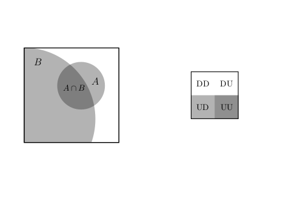
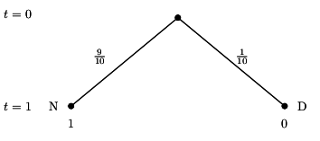
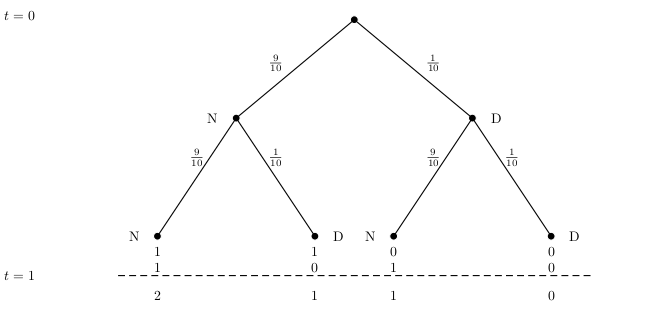
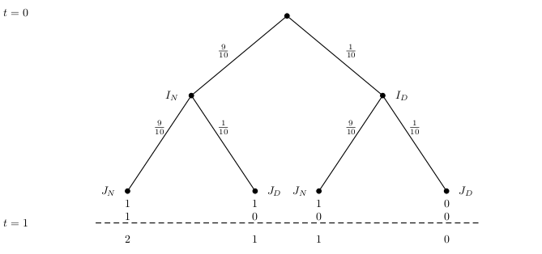
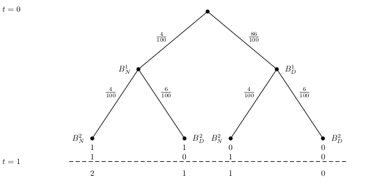

# Conditional Probability

## Contingency tables

We begin this lecture with a definition and an example. Here is the definition:

Contingency Table
: A contingency table shows counts of cases on one categorical variable contingent
on the value of another for every combination of both variables.

Contingency tables are useful for calculating **conditional probabilities** as they
contain all the necessary ingredients for the computation. The concept of
conditional probability and its applications
will be the main contents of this lecture.

Let us start with an example of a **contingency table** within the context
of stock price moves, we discussed already to some
degree in lecture 2. It gives me also an opportunity to point you to one
powerful R package, which will allow you to access financial data, quite easily for
yourself without me providing them to you with study material: The
`tidyquant-package`. You can check out the packages's home page with documentation and
study material at: https://business-science.github.io/tidyquant/.

Remember from lecture 1 that we can install add-on packages for R, which extend the
functionality of the system by new functions. A packages has to be installed first and then
loaded into working memory. To install tidyquant let us first use the install command:
`install.packages("tidyquant")` 
and then load the package by:
```{r  load-tidyquant, message = F}
library(tidyquant)
```

We do not go into the tidyquant package in any detail. If you are interested
check out the github page cited above. For now we only show the
use of one of its core functions which allows you to load financial data directly
from the internet. 

This function is called `tq_get()`. Let's see how it works. We first
retrieve the S&P500 stock market index. To do this we need to know the ticker symbol, which is
`^GSPC`. This has to be passed to the `tq_get()` function and that's it. Let us save these 
data into an R object, which I call `sp500`and look at the first entries
```{r load-sp-500}
sp500 <- tq_get("^GSPC")
head(sp500, n = 5)
```
We see that the series starts March 2011.
Now let's retrieve the stock price data of 
Apple beginning at 2011-01-03, the same day as the index data.
```{r read-others}
apple <- tq_get("AAPL", from = " 2011-01-03")
```
You can give a beginning date to the argument `from` in the `tq_get()` function (you can guess 
that you can also give an end data `to` as an argument to `tq_get`)

For the contingency table we would like to count the number of days when the
S&P was moving up from one day to the next and how often it was moving down. We would
like to do the same with the Apple stock price.

One way to see whether the price moved up or down from one day to the next is to
compute the daily price differences in  the closing price. When this difference is
positive the price made an up movement, when it is negative, it made a down movement (it
could theoretically also not change at all).

There are many ways to implement such a computation in R. Let me remind
you of the `diff()` function, we already used in lecture 2. It implements a method for
computing differences in time series. Consider the following example: Say we have
a vector of values like
```{r}
val <- c(2,4,7,1,9,10)
```
and we apply the `diff()`function we will get
```{r}
diff(val)
```

Now, of course by taking differences between 4 and 2, 7 and 4, 1 and 7, 9 and 1, ans 10 and 9 we
have to drop the first observation and get a vector which is shorter than `val` by one component.
We can
produce a vector of equal length if we add as the first component the value NA, which is
R's symbol of "not available" or of a missing value. Indeed this makes sense because for the
first date if you want we have no value for the change (since we cut off there and don't know
the value from the day before).

Now let us apply this reasoning to the Standard and Poors 500: The data of the index are in a
data frame. We can add a column to this data frame by the $ symbol followed by the
column name. This
symbol will append a new column with the name we write after $. Let us call this new
column "changes" and compute the changes in the closing price by the `diff()`function.
Now, since we loose the first value here by taking the first difference, let us
replace it by NA and from a new column of price differences with the first observation
replace by NA. Thus we type:

```{r changes-sp500}
sp500$changes <- c(NA, diff(sp500$close))
```
Lets do the same for the Apple stock price. 
```{r}
apple$changes <- c(NA, diff(apple$close))
```

Let me use this opportunity to introduce you to how R treats missing information. This is
a situation you will encounter all over in applied work with data in gerneral and with 
financial data in particular.

The `NA` character is a special symbol in R standing for "not available". It can be used as
a placeholder for missing information, just as we did before, where we inserted `NA` in the 
column of price changes for the first record, where we could no compute the difference, since
we had no information on the price the day before our dta set starts. `NA` is treated by R
exactly as you would expect that missing information should be treated. If oyu use it in
arithmetic operations or in comparisons, you will be returned `NA`. 

`NA` prevents oyu from mistakes made due to missing information. It can also 
create practical problems. If you would for instance try to compute the 
average price change of the apple
stock price
```{r treatment-of-na}
mean(apple$changes)
```
This is, of course, annoying. Just because there is one `NA` at the beginning of more than 2700
records, you should still be able to compute the mean. You just need to drop the `NA`. R has
an argument to most statistical functions, which allow you to drop the `NA` before you do the
computation, `na.rm`. When we set this argument to `TRUE` (or equivalently `T`), R is able
to do the computation:
```{r na-rm}
mean(apple$changes, na.rm = T)
```
Occasionally, you also want to identify or count the `NA` in your data with a logical test. For
this purpose R provides a special function `is.na()`. This function takes a value and checks
whether it is an `NA`. Say, for example, we have the vector:
```{r is-na}
vec <- c(1, NA, 2, 3, NA)
```
and then apply:
```{r test-na}
is.na(vec)
```
we get a vector of logical values. This vector would allow us then, by R's subsetting rules, to
select the non-NA values. We just tell R to select all elements from `vec` which are not `NA`:
```{r subset-logical-vec}
vec[!is.na(vec)]
```
This end our short digression into the treatment of missing information in R.

Let us now count the up moves and the down moves. Since there are only these two outcomes
it is sufficient if we add a logical column to both dataframes, checking the condition that
the change variable is larger than zero (note that with this test we automatically would
count the possible cases where the stock price remains unchanged to the down movements).
```{r}
sp500$up <- (sp500$changes > 0)
apple$up <- (apple$changes > 0)
```
We can now tabulate the joint up and down moves using the `table()`function. We give the
`dnn`argument to the function, sow we can see which are the dimensions in the table computation
R is performing for us. We also add the marginal sums by giving the output of the
`table`function to the `addmargins()` function of R:
```{r table}
addmargins(table(sp500$up, apple$up, dnn = c("SP500", "Apple")))

```
From this table you can read the total number of cases where it is true that
the SP500 index and the Apple stock price move 
up together, the number of cases when they fall together as well as
the number of cases where they move in opposite directions. The last row and 
the last column contain the row and column sums of all these cases.

So now we have used R to create a contingency table we can touch from our abstract
definition we gave in the beginning. On the way you deepened and fortified your knowledge of 
R a bit further.

## Marginal, joint and conditional probability

Marginal probability
: The **marginal probability** is the unconditional probability of an event. This
probability is not conditioned on any other event. In terms of notation, we
denote the marginal probabilities of two arbitrary events $A$ and $B$ by
$P(A)$ and $P(B)$ respectively.

Joint probability
: The **joint probability** is the probability of simultaneous events. This is
the probability of the intersection of two or more events. If $A$ and $B$ are
arbitrary events, we write $P(A \cap B)$.

Conditional probability
: The **conditional probability** is the probability of an event *given* that some other
event has occurred. The information from the event that has occurred can influence
the probability of the original event. The following notation is used for
conditional probabilities: For two events $A$ and $B$, the conditional probability of
$A$ given $B$ is denoted by $P(A\,|\,B)$ and the conditional probability of $B$ given
$A$ is denoted as $P(B\, |\, A)$. In general these two conditional probabilities are
not the same.

The table of joint moves, we have computed before can help us to illustrate
these concepts using the frequency interpretation of probability: We divide 
each entry in our table by the total number of cases. Of course this is so frequent
a case in applied data analysis that R has a function for it, the `prop.table()` function:
```{r prop-table}
prop_table <- addmargins(prop.table(table(sp500$up, apple$up, dnn = c("SP500", "Apple"))))
prop_table
```
The **marginal probability** that the SP500 will make an Up move is:
\begin{equation*}
P(\text{SP500-Up} \cap \text{Apple-Down}) + P(\text{SP500-Up} \cap \text{Apple-up}) = P(\text{SP500-Up})
\end{equation*}
which is
```{r marg.prob, echo = F}
round(prop_table[2,1] + prop_table[2,2], 2)
```
It is the sum
of the two **joint probabilities** $P(\text{SP500-Up} \cap \text{Apple-Down})$ and
$P(\text{SP500-Up} \cap \text{Apple-Up})$. 

To compute the conditional probability
that the stock price of Apple will make an up move given that the SP500 makes an
up move we have to compute $P(\text{Apple-Up} | \text{SP500-Up})$. The probability
that the Apple price went up and the SP500 went up is $P(\text{Apple-up} \cap \text{SP500-Up})$.

But given I already know that by the condition SP500 went up, I am in the second line of
my table and we know that the first line, SP500 went down - is ruled out by the
condition. 

We thus have now a *new sample space* and we must
adjust the probabilities proportionally
to be consistent with the rules of probability. We therefore have to divide by
$P(\text{SP500-Up})$ to get the formula
\begin{equation*}
P(\text{Apple-Up} | \text{SP500-Up}) = \frac{P(\text{Apple-up} \cap \text{SP500-Up})}{P(\text{SP500-Up})}
\end{equation*}
which is:
```{r cond-prob, echo = F}
round(prop_table[2,2]/prop_table[2,3],2)
```
To check whether we have made the correct re-normalisation you can ask yourself: Given the
rules of probability, what is $P(\text{Apple-Down} | \text{SP500-Up}))$ ? It should be 1 minus
the conditional probability that it goes up given the sp500 index goes up, which is
```{r, check-cond, echo = F}
1 - round(prop_table[2,2]/prop_table[2,3],2)
```
Applying the formula for conditional probability we would compute
\begin{equation*}
P(\text{Apple-Down} | \text{SP500-Up}) = \frac{P(\text{Apple-Down} \cap \text{SP500-Up})}{P(\text{SP500-Up})}
\end{equation*}
which is indeed
```{r cond-direct, echo = F}
round(prop_table[2,1]/prop_table[2,3],2)
```

Another way to think about this formula can perhaps help to foster our intuition if we
look at this problem through the frequency interpretation of probability:

We would like to
find the conditional probability that Apple makes an up move given that
SP500 makes an up move. Suppose the daily price moves are a conceptual
random experiment with the outcomes that the
price can either move up or down and we have two prices SP500 and Apple, so our
sample space has four possible outcomes:
${\cal S} = \{ UU, UD, DU, DD \}$ where the first character if it is U means SP500-Up
and the second if it is U means Apple-Up and so on for all possible combinations.
We repeat this
experiment 2752 times and keep a notebook where at every repetition we write down the
number of the experiment, the outcome and then we note whether both Apple and the SP500
went up.

| notebook line | outcome             | SP500-Up and Apple-Up ?|
|:-------------:|:-------------------:|:-----------------------:|
|1              |SP500-Up, Apple-Down | No                      |
|2              |SP500-Down, Apple-Up | No                      |
|3              |SP500-Up, Apple-Down | No
|4              |SP500-Up, Apple-Up   | Yes                     |
|.              |.                    |.                        |
|.              |.                    |.                        |
|.              |.                    |.                        |
|2752           |SP500-Up, Apple-Up   |Yes                      |

To get the conditional probability of a Apple-Up given an SP500-Up we have to count
the Google-Ups **among the notebook lines** where the SP500 has an Up move and divide by
the number of these SP500-Up lines.

Let's do this in R. To create the notebook we make a data frame where one column is the Up column
of the SP500 data and the second columns is the Up column of the Apple data. We remove
all `NA` in the data frame: This is achieved by applying the function `na.omit()`to the data
frame. It will remove all `NA`.

This provides a nice opportunity to introduce you to a very useful operator, which is
included in base R and which is called the pipe. It is available, since R version 4.1.0 and
it's symbol is `|>`. It allows you to make code in which several functions are nested
more readable. The way it works is that you can use the pipe to send a line of code or the
output of a fucntion as input to another function. In our case we would first create a data frame
and then pipe the frame to `na.omit()` to finally save it in an object we call `joint_ups`:
```{r df-joint-ups}
joint_ups <- data.frame(SP500Up = sp500$up, AppleUp = apple$up) |>
  na.omit()
```
Before R 4.1.0 there was a pipe operator with this functionality available through the `magittr` package, where it had the symbol `%>%`. When you work with R you will encounter this version of
the pipe sooner or later.

Now we apply what we have already learned about referencing values in a data frame in R to
select all the row numbers in our fictitious notebook where the SP500 moves Up and look at the
first rows:

```{r select-joint-moves}
sel_joint <- joint_ups[joint_ups$SP500Up == TRUE, ]
head(sel_joint, n = 5)
```
To count the number of rows we can use the `nrow()` function.
```{r count-rows-joint}
dim(sel_joint)
```

It says that the number of notebook lines where the SP500 makes an Up move. The result
should not surprise us, for we already derived it using the contingency table.

Now, let us count the Ups in the Apple occurring simultaneously with the SP500 ups. Here we
use the logical operator `&` which is R's syntax for the set symbol $\cap$:

```{r}
joint_ups$simultaneous = (joint_ups$SP500Up & joint_ups$AppleUp)
```

Now we can make use of R's precedence rules to count the simultaneous up moves

```{r}
sum(joint_ups$simultaneous)
```

Now we compute the relative frequency of joint up moves among all the lines where
the SP500 moves up, which is
```{r notebook-approach, echo = F}
round(sum(joint_ups$simultaneous)/dim(sel_joint)[1], 2)
```
as we have indeed derived before using the contingency table.
```{r cond-probability-visualized, out.width='90%', fig.align='center', fig.cap='A Visualization of conditional probability ', echo = F}

```
On the left you see the sample space symbolized as a square and the area of event $B$, SP500-up,
is the proportion of the whole sample space taken up by this event, whereas event $A$, Apple-up 
is the proportion of the *whole* sample space taken up by this event. When it is known 
that $B$ has occurred, the sample space changes and the event that both, SP500-up and Apple-up
is in the intersection of both areas and the conditional probability is the area of this
intersection as a proportion of $B$. On the right you see a picture of our notebook metaphor using
the same color codes. The conditional probability is the ratio of all violet stripes as a
proportion of all blue stripes.

We now can give the

Formal definition of conditional probability
: Let $A$ and $B$ be given events. We define the **conditional probability** of $A$ given $B$
as
\begin{equation*}
P(A\,|\,B) = \frac{P(A \cap B)}{P(B)}\,\,\, \text{provided}\,\,\, B \neq 0
\end{equation*}

Note that for conditional probabilities we have for two events $A$ and $B$, that
$P(A|B) \neq P(B|A)$.
To see this assume that $P(A) \neq P(B)$ and $P(A) \neq 0$ and
$P(B)\neq 0$. 

We then get:
\begin{equation*}
P(A|B) = \frac{P(A\cap B)}{P(B)} = \frac{P(B \cap A)}{P(B)}
\end{equation*}
since $P(A \cap B) = P(B \cap A)$.
It follows that
\begin{equation*}
\frac{P(B \cap A)}{P(B)} \neq \frac{P(B \cap A)}{P(A)} = P(B|A)
\end{equation*}
since we
have assumed that $P(A) \neq P(B)$. 
Therefore $P(A|B) \neq P(B|A)$.
You can check this with the stock example, we discussed before.

## The multiplication rule

The following formula is often called the **multiplication rule** and is just a
rewritten form of the definition of conditional probability.

Multiplication rule
: Given events $A$ and $B$ it holds that
\begin{equation*}
P(A \cap B) = P(A | B)\times P(B)
\end{equation*}

The multiplication rule can give us a deeper insight into the notion of
independence, we discussed earlier. Remember that two events $A$ and $B$ are independent
if $P(A \cap B) = P(B \cap A) = P(A) \times P(B)$. 

If we combine this rule with the
concept of conditional probability, we see that if two events $A$ and $B$ are independent, then
\begin{equation*}
P(A|B) = \frac{P(A \cap B)}{P(B)} = \frac{P(A) \times P(B)}{P(B)} = P(A)
\end{equation*}
and
\begin{equation*}
P(B|A) = \frac{P(B \cap A)}{P(A)} = \frac{P(A) \times P(B)}{P(A)} = P(B)
\end{equation*}

This formula says that if two events are independent the probability of $A$ is
not influenced by the event $B$ occurring and the probability of event $B$ is not
influenced by the event $A$ occurring.

## Law of total probability


## Example: Independence and the Financial Crisis of 2007-2008

In this example, we will go back to the financial crisis of 2007-2008, in which the
global financial system almost completely collapsed. While the history 
of the crisis as well as the institutional details of structured Finance are
very complicated, a conceptual root problem of structured finance and the crisis
has a lot to do with conditional probabilities. Let's see why.

To set the stage we need some background from Finance first. We begin with the
definition of a **bond**.

Bond, face value, par value
: A **bond** is an obligation be a bond issuer to pay money to the bond-holder according
to the rules specified at the time the bond is issued. Generally, a bond pays a specific amount,
its **face value** or equivalently its **par value** at the date of maturity.

Bonds are the biggest and most liquid class of fixed-income securities and have tremendous
practical importance as investment vehicles. The details are very involved and we ignore them
here.

Although bonds offer a fixed-income stream, they are subject to default, if the issuer has
financial difficulties or gets into bankruptcy. So there is a certain credit risk in bonds.

To characterize the nature of these risks bonds are usually **rated** by rating organisations. The
two primary ratings are issued and published by Moody's and Standard and Poor's. 

Bonds that are either high or medium grade are considered to be **investment grade**. Bonds
that are below the speculative category are often called **junk bonds**. The rating is 
usually based on a statistical analysis of various financial ratios of the issuer, such as 
leverage, debt to equity, cash fow to outstanding debt etc. Bonds with a lower rating
will have a higher probability of default and 
a lower price than a comparable bond with a higher rating. The following table
shows the rating schemes of Moody's and Standard and Poor's.

|                  |  Moody's| Standard & Poor's | 
|:-----------------|--------:|------------------:|
|High grade        | Aaa     | AAA               |
|                  | Aa      | AA                |
|Medium grade      | A       | A                 |
|                  | Baa     | BBB               |
| Speculative grade| Ba      | BB                |
|                  | B       | B                 |
| Default Danger   | Caa     | CCC               |
|                  |Ca       | CC                |
|                  |C        |C                  |
|                  |         | D                 | 


In the early 2000's financial innovations came to the market that proposed the practice 
of **pooling** and **tranching** bonds to transform the risks of junk 
bonds in a way that some good risks. An important asset class created by these
financial engineering techniques were **mortgage backed securities**.

Let us explain the idea. Let's imagine a bond that is issued today - at $t = 0$ and
matures in a year from now, tomorrow, at $t = 1$. It pays off $1$ euro at maturity, but
there is a certain risk of a default, in which case it pays nothing or $0$. 

You might imagine this bond as an event tree. Since it is a junk bond, this default happens
with probability $P(\text{default}) = 0.1$. 
```{r simple-tree, out.width='90%', fig.align='center', fig.cap='A simple event tree for a defaultable bond', echo = F}


```
Lets assume now that we have two junk bonds of this kind. Now the sample space is bigger than
before. Since we have two possible outcomes for each of two bonds, we are in a simiar 
situation as when we toss a fair coin twice. The sample space is now ${\cal S} = \{ B^1_D B^2_D,
B^1_D B^2_N, B^1_N B^2_D, B^1_N B^2_N \}$. Let's try to visualize this situation also in a tree.
```{r two-stage-tree, out.width='90%', fig.align='center', fig.cap='An event tree for two defaultable bond with independent defaut probabilities', echo = F}


```
The tree is interpreted as follows: Each dot is called a **node**. The tree is organized
by levels, the top node or **root** being level 0. The next layer is layer 1 and so on. 
The tree might symbolize a sequence with one layer happening before the other, or here
in our case a simultaneous event of two bonds reaching their state at $t=1$. 

Probabilities are written along the edges of the tree. The probability of $B^1_N$ - the probability
that the first bond dies not default - is $\frac{9}{10}$. It is written on the edge from the root
to the node labeled $B^1_N$. At the next level we put the **conditional** probabilities. The
edge from $B^1_N$ to $B^2_N$ is $P(B^2_N\,|\, B^1_N)$. By the multiplication rule the
probability of getting to any node is just the product of the probabilities along the edges.
\begin{equation*}
P(B^1_N \cap B^2_N) = P(B^1_N) \times P(B^2_N\,|\, B^1_N)
\end{equation*}
Now if we assume that the risks are **independent** this would just be
\begin{equation*}
P(B^1_N \cap B^2_N) = P(B^1_N) \times P(B^2_N) = \frac{9}{10} \frac{9}{10} = \frac{81}{100}
\end{equation*}
You can work out all the other probabilities now for yourself.
At the end nodes of the tree, I have written the payoffs of the two bonds if we go along the
edges of the particular path. The payoff of $B^1$ is above and the payoff of $B^2$ is written
below. Belwo the dashed line I have written the *aggregate* payoff of both bonds or the sum
of their individual payoffs.

The law of total probability can also be illustrated nicely in this tree picture. For
example $P(B^2_D)$ is just the sum of all probabilities of the paths, leading to $B^2_D$ which
is given the current tree just 
$\frac{9}{10} \frac{1}{10} + \frac{1}{10} \frac{1}{10} = \frac{1}{10}$.

Some of you might have realized that the tree gives us an equivalent representation to what
we would have got from a contingency table. To see this, look at:

|                  |  $B^2_D$| $B^2_N$ | 
|:-----------------|--------:|--------:|-----:|
|$B^1_D$           | 1/100   | 9/100   |1/10          
|$B^1_N$           | 9/100   | 81/100  |9/10          
|Total             | 1/10    | 9/10    |  1         

Now you need to be prepared for a piece of financial magic, which we perform by
applying the concepts of **pooling** and **tranching**. We put the two (junk) bonds
into a pool or a portfolio to create two new bonds out of them by contractually altering
the payoff structure. Let us call these bonds $I$ and $J$ for investment grade and junk.
But how is this possible, can we really take two junk bonds as an input and rearrange
their payoff to get an investment grade and something else? Here is how
```{r two-stage-tree-pooled, out.width='90%', fig.align='center', fig.cap='An event tree for two synthetic bonds built on the junk bonds $B^1$ and $B^2$ with independent defaut probabilities', echo = F}


```
What we see here is a slightly modified tree for the two new bonds $I$ and $J$. The reading is
now a bit complicated because $I_D$ means $I$ in the state where $B^1$ defaults etc. Note that
below the dashed line you see that the sum of payoffs did no change. So when we pool the
initital two junk bonds and tranch them into the two new payoff structures, we can fulfill
all promises from the cash flow of the pool. 

Here is the magic: $I$ is a bond that pays on all states, except when both $B^1$ and $B^2$ default.
Under the assumption of independence, the probability of such a state occuring is just $1/100$. 
Thus, given the independence assumption both Moody's and Standard and Poor's could now grade 
the new bond as investment grade. The other bond $J$ now never pays off except in the state where
both $B^1$ and $B^2$ would not default. It defaults, thus with probability $99/100$. It has 
become toxic junk. Thus here we have the magic at work: We took junk plus 
junk and got investment grade and toxic junk. Now this game was played as a trillion dollar 
business, mainly with mortgages but also with other security classes, like car loans, studnet loans and credit card debt. 
Special investment vehicles
sponsored by banks would pool and tranch the various asset classes, 
rating agencies would rate and investors hungry for safe
investments would buy the synthetic investment grade bonds.

But what would happen, if independence does **not** hold and our risks are *dependent** instead? 
Contemplating this possibility is not very far fetched. After all, if a bond issuer comes
into difficulties to fulfill his promise it is perhaps because of an event affecting other bond
holders as well, or the fact that he defaults creates problems for other bondholders 
who had relied
on the promise of the bond issuer in trouble to make his contracted payments.

A situation like this could be captured perhaps by the following variation of our tree.
```{r dependent-risks, out.width='90%', fig.align='center', fig.cap='An event tree for two synthetic bonds built on the junk bonds $B^1$ and $B^2$ with dependent defaut probabilities', echo = F}


```
Now this situation looks only slightly different. But now the risks are dependent. Note that the
total probabilities of each outcome have stayed the same. For example the probability of
$B^1_D = \frac{6}{100} + \frac{4}{100} = \frac{1}{10}$, $B^1_N = \frac{4}{100} + \frac{86}{100} = \frac{9}{10}$. You can work out the other probabilities yourself. But now the risks are
dependent. Note that 
\begin{equation*}
P(B^1_N \cap B^2_N) = P(B^1_N) \times P(B^2_N\,|\, B^1_N)
\end{equation*}
Note that now, what was investment grade before is now from a rating viewpoint again junk,
and we are back in the more intutitive world where jung plus junk is still junk. This truth
was hammered home to a world falling prey to the biggest financial crisis since the great 
depression of the 1930ies. The carelessness with not sufficiently thinking about the
justification for an undue and dangerous independence assumption is arguably one of the
root causes of this disaster. But you know know better.


## Bayes' Rule

The definition of conditional probabilities has an important implication about the relation
between the probabilities of events, which is known as *Bayes' rule*. Lets say we have two
events $A$ and $B$, then we know from the definition of conditional probability that
$P(B|A) = \frac{P(B \cap A)}{P(A)}$. Since $P(B \cap A) = P(A \cap B)$ we have
$P(B|A) = \frac{P(B \cap A)}{P(A)} = \frac{P(A \cap B)}{P(A)}$ which is by definition
equal to $\frac{P(A|B) \cdot P(B)}{P(A}$ provided that $P(A) \neq 0$. The terminology
calls $P(B)$ the *prior probability* of $B$ and $P(B|A)$ is called the *posterior probability*.

One way to think about the relation
$P(B|A) = \frac{P(A|B) \cdot P(B)}{P(A}$ is to think about the event $B$ as some hypothesis and
the event $A$ as data or information.
## R-Concepts

Example structured finance and violations of independence

## Project