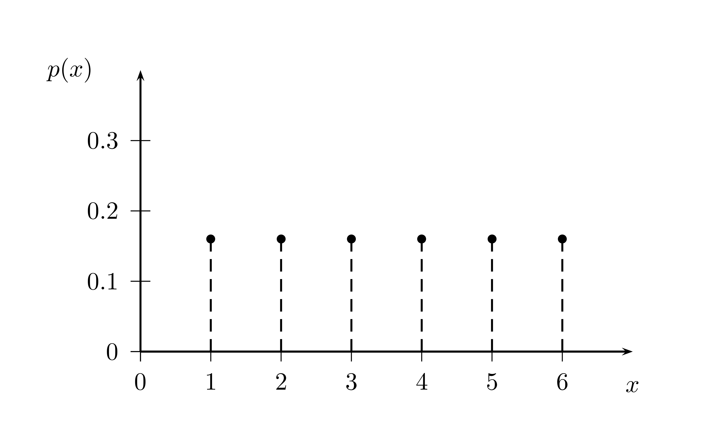
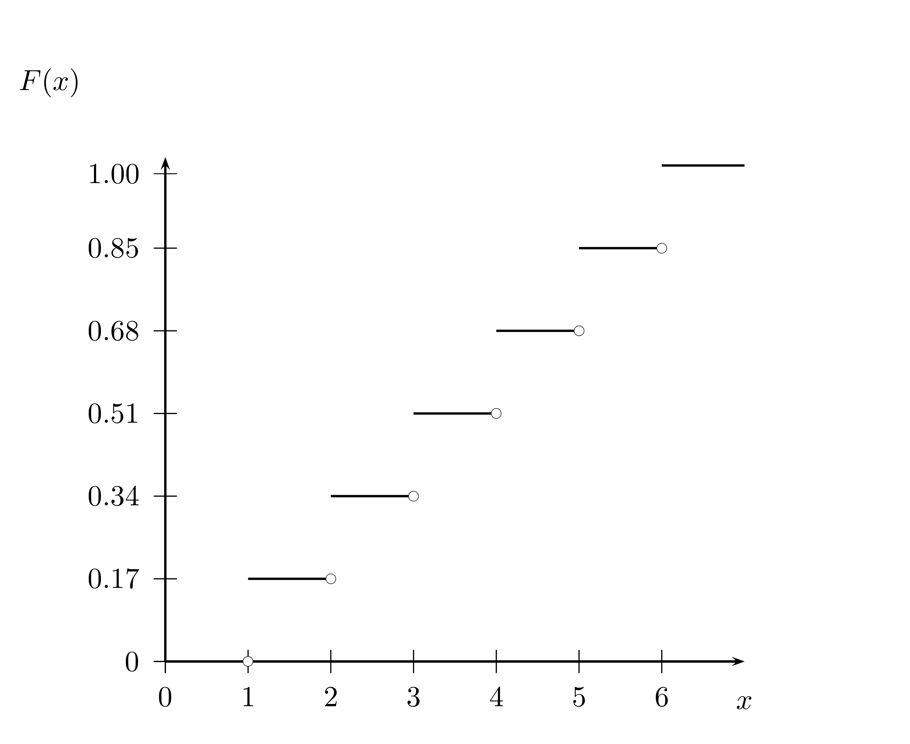
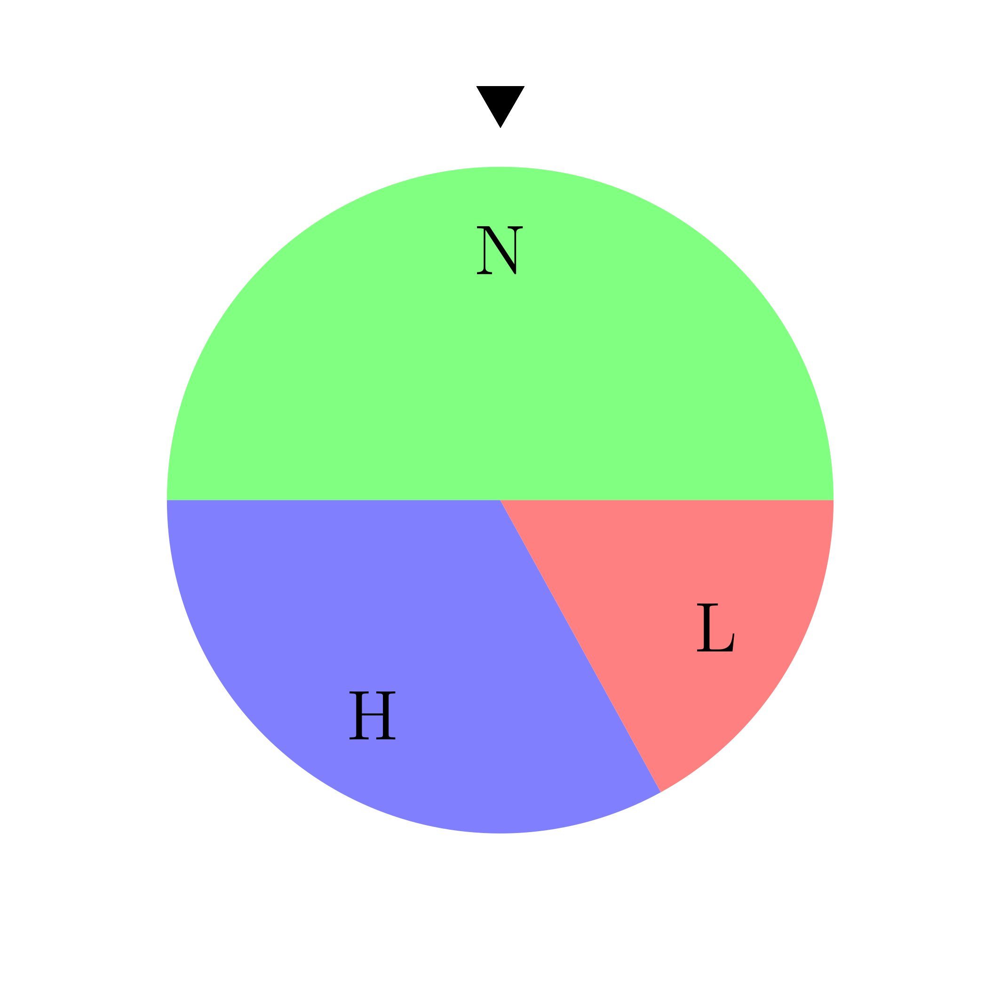

# Random Variables

## Discrete Distributions

We now come to an extension of the simple probability model 
which is very useful. This is the concept of a random variable.
We have implicitly already used this concept with our virtual
dice and in our example and project on investing and updating believes.

Let ${\cal S}$ 
be some finite set - a sample space -  and $P(x)$ a 
probability on ${\cal S}$. A **random variable** is a 
function assigning numbers to points of ${\cal S}$.
The notation ${\cal S}$ has been chosen deliberately 
to connect this lecture with the previous ones. So we get the following
definition

Random variable
: A **random variable** is a function defined on  the sample space.

The term random variable might be slightly confusing, for what is 
really meant is something like a random function where 
the range is the sample space, i.e. the outcome of a 
random experiment, and 
the image is the set of real numbers.

Think of the payoff promise in the investment game, we analyzed in
lecture 3. The sample space for the flip of a coin is the set
${\cal S}=\{H, T\}$. They payoff for a player who has won the
auction for a flip is: 2, if the coin lands on heads, 0 if the coin
lands on tails. This uncertain payoff promise can be
formalized as a function from ${\cal S}$ to $\{2,0\}$, with the
rule that H is mapped to 2 and T is mapped to 0.

It is a widely held convention in probability theory to 
denote random variables by capital letters, like $X$ and $Y$ 
and their values are denoted by $x$ and $y$ respectively.

Let $X$ be a random variable and let $x_1, x_2, \dots , x_n$ denote 
the values it can assume. The
aggregate of all sample points on which $X$ assumes the 
fixed value $X = x_j$ forms the event
that $X = x_j$. Its probability is denoted by $P(X = x_j)$.

When a random variable can only take finitely many or 
uncountably many values, i.e. when the 
sample space contains only finitely many or uncountably 
many basic outcomes, we say that the
random variable is **discrete**.

Probability distribution
: The function $P(X = x_j) = p(x_j)$ for $j = 1, \cdots ,n$ is called 
the **(probability) distribution** of the random variable $X$. 

This function completely 
describes the probability properties of the random variable. 
Note that $p(x_j) \geq 0$ and $\sum_{j=1}^n p(x_j) = 1$.

A related concept is found in the follwing important definition

Cumulative distribution
: The **cumulative distribution function** - abbreviated CDF - shows 
the probability that a 
random variable $X$ take a value less than or equal to a given 
value $x$. It is usually denoted as $F(x) = P(x \leq x)$ 
where $-\infty < x < \infty$.

We have actually already encountered a random variable in 
our very first lecture, where we discussed
the six sided fair die. The random variable $X$ is in this
case a map (the identity map) from the six basic outcomes
${\cal S}=\{1,2,3,4,5,6\}$ to the number of points
$\{1,2,3,4,5\}$. If the die is fair, 
each of these outcomes has probability $1/6$.

It is common to display the probabilities associated 
with a random variables, graphically as 
a probability distribution.

```{r pdf-die, out.width='90%', fig.align='center', fig.cap='The probability distribution of the random variable of rolling a six sided die', echo = F}

```
The cumulative distribution function of this random variable can
be visualized as a step function:
```{r cdf-die, out.width='90%', fig.align='center', fig.cap='The cumulative distribution function of the random variable of rolling a six sided die', echo = F}

```

The notion of a distribution can be generalized to more than one random variable. Consider
two random variables $X$ and $Y$, defined on the same sample space ${\cal S}$. Denote the
values they assume by $x_1, x_2, x_3, ..., x_n$ and $y_1, y_2, y_3, ..., y_m$ respectively. Let
the corresponding distributions be $f(x_i)$ and $g(y_j)$.

The aggregate points in which the two conditions $X = x_i$ and $Y = y_j$ are satisfied
form an *event* whose probability is denoted by $P(X = x_i, Y = y_j$)

Joint probability function
: The function
\begin{eqnarray*}
P(X = x_i, Y = y_j) = p(x_i, y_j), \quad i = 1, \cdots, n \,\, j = 1, \cdots, m
\end{eqnarray*}
is called the **joint probability distribution of $X$ and $Y$.

Note that we must have
\begin{eqnarray*}
p(x_i, y_j) &\geq& 0, \quad i = 1, \cdots, n \,\, j = 1, \cdots, m \\
\sum_{i=1}^n \sum_{j = 1}^m p(x_i, x_j) &=& 1
\end{eqnarray*}

Moreover for every fixed $i$ and for every fixed $j$ we have:
\begin{eqnarray*}
p(x_i, y_1) + p(x_i, y_2) + \cdots + p(x_i, y_m)&=&P(X = x_i)&=&f(x_i)\\
p(x_1, y_j) + p(x_2, y_j) + \cdots + p(x_n, y_j)&=&P(Y = y_j)&=&g(x_j)
\end{eqnarray*}

If you go back to lecture 3, where we discussed conditional probability, this 
should look very familiar. These notions carry over to the concepts of random
variables. With the notion of a joint probability we also get a notion of 
conditional probability for random variables:

Conditional probability
: The **conditional probability** of the event $Y = y_j$ given that $X = x_i$ is
\begin{equation*}
P(Y = y_j | X = x_i) = \frac{p(x_i, y_l)}{f(x_i)}
\end{equation*}
where we need to require that $f(x_i) > 0$.

With this definition, a number is associated with every value of $X$ and so conditional
probability defines a function of $X$. This function is called the **conditional distribution**
of $Y$ for *given* $X$.

Mutually independent
: Two random variables are called **mutually independent** if for any combination of values
$x_1, ..., x_n$, $y_1, ..., y_m$
\begin{equation*}
P(X = x_i, Y = y_j) = P(X = x_i) P(Y = y_j)

## Expected value

Sometimes the entire probability distribution is difficult to grasp at once. It is common to 
describe probability distributions therefore by a summary measure. Among the typical summary
measures the **expectation** or the **mean** is by far the most important one.

Expected Value
: The expected value $\mathrm{E}(X)$ of a discrete random variable $X$ 
is the probability weighted sum of all its possible values:
\begin{equation*}
\mathrm{E}(X) = x_1p(x_1) + x_2 p(x_2) + \cdots + x_n p(x_n)
\end{equation*}
Note that in the definition we have covered the case where the number of possible outcomes
is finite. In the other case where the number of possible outcomes is countably infinite we need 
additional convergence conditions for the infinite series defined by the sum of the $x_i p(x_i)$.
We ignore this case here.

The term expected value can be a bit misleading, for it might suggest that the expected value is 
something we "expect" to occur. It is - to the contrary - pretty often unlikely and
sometimes even impossible.

As an example, remember our fair die. Its expected value is, if you apply the definition above:
```{r exp_value_die}
1*1/6+2*1/6+3*1/6+4*1/6+5*1/6+6*1/6
```
a value that will never actually come up.

### Properties of expected value

**Property 1: Adding or subtracting a constant**:
Let $X$ be a random variable and you add a constant $a$ then
$\mathrm{E}(X \pm a) = \mathrm{E}(X) + a$

This is almost immediate from the definition, because you can split the probability weighted sum
of $X + a$ into a probability weighted sum of $X$ plus a probability weighted sum of $a$. For
the term involving $a$, you can factor out $a$ and since the probabilities sum to 1 we have the
formula.

**Property 2: Multiplying by a constant**: 
If $X$ is a random variable and $a$ is a constant, then
$\mathrm{E}(a X) = a \mathrm{E}(X)$.

**Property 3: Transformation by a function**
If $X$ is a random variable, then any function $f(x)$ defines a new random $f(X)$ and 
\begin{equation*}
\mathrm{E}(f(X)) = f(x_1) p(x_1) + f(x_2) p(x_2) + \cdots + f(x_n) p(x_n)
\end{equation*}

**Property 4: Linearity of expected value**
if $X$ and $Y$ are random variables and $a$ and $b$ are constants, then
\begin{equation*}
\mathrm{E}(a X + b Y) = a \mathrm{E}(X) + b \mathrm{E}(Y)
\end{equation*}

To see this, we can write $\mathrm{E}(a X) + \mathrm{E}(b Y)$ by Property 2 as $a \mathrm{E}(X) + b \mathrm{E}(Y)$ which is
by definition
\begin{equation*}
a \sum_{i=1}^n \sum_{j = 1}^m x_i p(x_i, y_j) + b \sum_{i=1}^n \sum_{j = 1}^m y_j p(x_i, y_j)
\end{equation*}
Rearranging gives:
\begin{equation*}
\sum_{i=1}^n \sum_{j = 1}^m (a x_i + b y_j) 
\end{equation*}
which is $\mathrm{E}(aX + bY)$.

## Variation

While the expected value of a random variable provides a very useful summary measure for
a distribution, we typically also want information about the amount of variation of a
a random variable. One such measure, which gives us a degree of possible deviation from the mean
is the **variance**.

Variance
: The **variance** of a random variable $X$ is the expected value of the squared deviation
from the expected value of $X$ or
$Var[X] = \mathrm{E}[(X -\mathrm{E}[X])^2]$

Note that we cab simplify the expression for the variance as follows:
\begin{align*}
\mathrm{E}((X-\mathrm{E}(X)^2)) & = \mathrm{E}(X^2 - 2 X \mathrm{E}(X) + \mathrm{E}(X)^2) \\
              & = \mathrm{E}(X^2) - 2 \mathrm{E}(X)\mathrm{E}(X) + \mathrm{E}(X)^2 \\
              & = \mathrm{E}(X^2) - \mathrm{E}(X)^2
\end{align*}

In the case of a discrete random variable, the case we discuss in this lecture, we have
$\mathrm{Var}(X) = \sum_{i=1}^{n} \left(x_i - \mathrm{E}(X) \right)^2 p(x_i))$. 

Note that the units of the variance are the
squared units of the random variable. This is often not very useful for interpretations. This
leads us to the concept of a standard deviation:

Standard Deviation
: The **standard deviation** of a random variable $X$ is the square root of the variance of $X$,
denoted $\mathrm{SD}(X) = \sqrt{\mathrm{Var}(X)}$.

Let's discuss a few properties of the variance.

**Property 1**: If $X$ is a random variable and $c$ is a constant, then
\begin{equation*}
\mathrm{Var}(c X) = c^2 \mathrm{Var}(X)
\end{equation*}
You could try to prove this equation, just using the definition of variance and the 
properties of expected value. We do not go into these details here but this
property should make sense to you. If we multiply a random variable by say 3, its average
squared distance from its mean should increase by a factor of 9.

**Property 2**: If $X$ is a random variable and $d$ is a constant
\begin{equation*}
\mathrm{Var}(X + d) = \mathrm{Var}(X)
\end{equation*}

Shifting over a random variable by a constant does not alter the variance. This should make
sense, since the variance of a constant must be 0. Why? Lets use the definition:
\begin{equation*}
\mathrm{Var}(d)= \mathrm{E}(d^2) - \mathrm{E}(d)^2 = d^2 - d^2 = 0
\end{equation*}
This should be clear, after all a constant never varies.

Assume we have two random variables $X$ and $Y$ then we define their **covariance**
as follows.

Covariance
: The ++covariance** for two random variables $X$ and $Y$, is defined as
\begin{equation*}
\mathrm{Cov}(X,Y) = \mathrm{E}((X - \mathrm{E}(X))(Y-\mathrm{E}(Y)))
\end{equation*}

Note that $\mathrm{Cov}(X,Y) = \mathrm{E}(XY) - \mathrm{E}(X)\mathrm{E}(Y)$. 
If $X$ and $Y$ are independent, then $\mathrm{E}(XY) = \mathrm{E}(X)\mathrm{E}(Y)$,
hence if $X$ and $Y$ are independent, $\mathrm{Cov}(X,Y) = 0$. Note, however, 
that the converse is not true.
A covariance of 0 does **not** imply independence.

The choice of an origin and unit of measurement of a random variable is to a large 
degree arbitrary. It is thus often most convenient to take the mean as the origin and the
standard deviation as unit. Denote the mean of a random variable $X$ as $\mu$ and the variance as
$\sigma^2$. In this case $X-\mu$ has mean zero and variance $\sigma^2$, and hence the variable
$X^* = \frac{(X-\mu)}{\sigma}$ has mean 0 and variance 1. If we take the covariance
of two such normalized random variables we get the so 
called **correlation coefficient** $\rho(X,Y)$.

Correlation Coefficient
: The **correlation coefficient** of two random variables $X$ and $Y$ is defined as
\begin{equation*}
\rho(X,Y) = \mathrm{Cov}(X^*,Y^*) = \frac{\mathrm{Cov}(X,Y)}{\sigma_x \sigma_y}
\end{equation*}

The correlation coefficient is thus just a particular way of writing the covariance.

Now this was a bit of a large theory junk. It is time we get back to R and play around 
with these concepts a bit. As a finance class you should be motivated to know these
concepts well because they are a sort of cap-stone for investment science and portfolio
management.

Indeed random variables are the most important models in Finance. In the next example
we will study the concepts of this section by putting them in a Finance context. In doing so
we will also embark into a new territory of R. We will now also learn the basics of
writing R programs using portfolio and investment theory as an example.

## Random variables, expected value, variance and covariance: The cornerstone for modeling investments under uncertainty

An important case where probability is applied in Finance is the problem of analyzing
risky investment decisions: When you
make an investment with a known initial outlay of capital the amount to be returned from the
investment in the future is unknown. In some cases, say when you invest in very liquid assets
classes which are constantly traded on markets, like stocks and bonds, you might have an idea
on the probability of certain return prospects for investment informed by past data. This
case of *random returns* is one of the most intensively used applications of probability
to Finance. Since random variables are the models of choice in this case, we study such an
investment problem now.  

It is at the same time an ideal examles to push the frontier of your knowledge of R, because we
can discuss in this context how to write programs and run more complex simulations 
than we did so far. 

Let us focus first on a class of investment problems where we only have a single 
investment period: Money
is invested at an initial time and a payoff is attained at the end of this period. Random
variables are a concept that allows us to construct models for thinking about and analyzing the
uncertainty inherent in such practical situation. While the assumption of a single
period is an idealization that does not apply to public stocks such models are applied to
this common class of investments as a simplification. For other situations the one period
model is sometimes a pretty good approximation. Think of a zero-coupon bond that will be
held to maturity. Or think about an investment in a physical project that only will yield 
a payoff when completed.

These kinds of simplifications are - by the way - a cornerstone in modelling as well as in
programming. We build solutions to complex problems by starting with a simple problem and then
buid complexity step by step.

### Asset Return

Before we dive into the modelling of investment problems with uncertainty using probability and
random variables as a tool, we need to introduce some financial concepts first: An 
investment instrument that can be bought and sold is called an **asset** in Finance. If $X_0$ is
the amount invested today and $X_1$ is the amount received "tomorrow", say for example in a 
year from now, the **total return** is defined as the ratio of the amount received to 
the amount invested or formally $R = \frac{X_1}{X_0}$. Often we simply use the term return.
The **rate of return** is defined as the difference between the amount received and the amount
invested in relation to the amount invested or $r = \frac{X_1-X_0}{X_0}$. Often people also 
speak of return when they refer to the rate of return. Both notions are related by the
equation $R = 1+r$ and the equation for the rate of return can be rewritten as $X_1 = (1+r)X_0$. 
This shows that the rate of return acts much like an *interest rate*.

When an asset is initially acquired, its rate of return is uncertain. Modelling the rate of
return as a random variable is one possibility to describe and analyze this situation of
uncertain returns.

## Random returns

We are now going to build a model of random returns that we can use to simulate the payoff
consequences of portfolio investment decisions as well as for giving a concrete context to the
abstract notions we introduced before. This will show you their power as well as their practical
relevance in Finance.

How do actual returns look like? Let's go back to the example of the S&P 500 - a broad stock
market index - we discussed before.
```{r}
sp500 <- tq_get("^GSPC", get = "stock.prices", from = "2011-01-03", to = "2021-12-22")
head(sp500, n = 5)
```
Now let's use R to add a column with daily returns based on the variable `adjusted` the adjusted
index value, which takes into account dividend payments and other things. Our knowldege of how
to manipulate R objects by subsetting rules and the application of functions is already there
from our lecture on conditional probability:

We add a column of first differences $X_{t+1} - X_t$ for $t \in \{2, \cdots ,2762\}$. We have to 
start at the second row because for the first observation we have no previous observation to 
deduct. Thus when we add a new column to the data frame we need a column of
equal length, so we put an `NA` in the beginning of the returns column. We then have to divide by $X_t$ for $t \in \{ 1,\cdots, 2761\}$ because for the last 
observation we have no next observation to deduct the last one from and divide by it.

Remember that we can refer to elements in an R object by indexing with numbers. If we apply
the `length()`function to an object we get the number of components and thus the number of the
last element in an object. This we drop. The first difference we already know how to deal with. So let's
add returns
```{r}
sp500$returns <- c(NA, (diff(sp500$adjusted, lag = 1)/sp500$adjusted[-length(sp500$adjusted)]))
```
Now it is always a good idea when you write complex commands like this to check whether the code
is doing what you want. The second and the first value of the `adjusted`variable is:
`r sp500[2,"adjusted"]` and `r sp500[1,"adjusted"]`. Thus the return is 
`r (sp500[2,"adjusted"] - sp500[1,"adjusted"])/sp500[1,"adjusted"]`. The first value in our returns
variable is:
```{r check-returns}
sp500$returns[2]
```
This looks good. Now let us use our little graphical knowledge to look at the distribution of
returns in our data using the `qplot`function. We drop the `NA` and :
```{r return distr}
qplot(sp500$returns[-1], binwidth=0.01)
```
This picture suggests that returns are pretty much distributed symmetrically around 0, and in
very rare cases rise and drop a bit more than 5 % per day.

Note that this is a histogram, which means that we binned the return data into buckets of 1 % and
plotted it. It would be natural to assume a continuous sample space for modeling returns. We will
discuss such models in the next lecture. 

Here we take a choice where we model randomness using discrete random variables. We do so
by combining two random devices, constructed as a *wheel of fortune*. Both kinds
of wheels are useful for the study of investments. Our *wheel of fortune* looks like this:
```{r wheel-of-fortune, out.width='90%', fig.align='center', fig.cap='A wheel of fortune. If the wheel stops at the segment under the marker your payoff is determined according to the rules of the game', echo = F}

```
If you invest an amount of money in the wheel, your payoff will be determined according to the
rules of the game depending which segment ends up under the marker (the triangle above the wheel).
The wheel is constructed such that it stops at segment $N$ with probability $\frac{1}{2}$, it stops
at $H$ with probability $\frac{1}{3}$ and at $L$ with probability $\frac{1}{6}$.

There is another random device, before the wheel is spun, which is a coin, which is flipped and
ends up on $B$ (for boom) with probability $\frac{3}{5}$ or $R$ (for recession) with
probability $\frac{2}{5}$.

This creates in total 6 outcomes ${\cal S} = \{BN, BH, BL, RN, RH, RL\}$ with probabilities
$p(x) = \{0.3, 0.2, 0.1, 0.2, 0.13, 0.07\}$. 

In this game you have some initial wealth, which you may invest into 3 alternative assets.
They have a payoff-structure described in the following tables:

If the coin lands on $B$:

|Wheel | Asset 1 |Asset 2 | Asset 3|
|:----:|:-------:|:------:|:------:|
|H     |    1    |  10    |   6    |
|N     |    1    |   6    |   5    | 
|L     |    1    |   2    |   4    | 

If the coin lands on $R$: 

|Wheel | Asset 1 |Asset 2 | Asset 3|
|:----:|:-------:|:------:|:------:|
|H     |    1    |  5     |   3    |
|N     |    1    |  3     |   2.5  | 
|L     |    0    |  1     |   2    | 

You can allocate your wealth between the three assets and have to pay the following prices
per unit $q = \{0.93, 5.86, 4.625 \}$. You can not invest more than your initial wealth of
1000. You can neither sell nor short sell any of the assets. 

You may think of these assets as a bond an two stocks. Asset 1, the bond,
pays a fixed amount in each
state, except when things go very bad and it defaults and pays nothing. Asset 2 and Asset 3
could be thought of as two stocks where Asset 2 has a higher variation in its payments across
states. These are the rules of the game.

Now here is the programming challenge we undertake in several steps: We build a function that
randomly chooses an outcome according to the probabilities we have specified and then
determine the payoff of each asset according to the rules of the game. When we are finished
with this step it will look something like this: When you give your portfolio to the `outcome()`
function you will get the state, the payoff of the different assets and the return.
`outcome(portfolio)`

The first step in this program, you already know from previous lectures. Let us call
this function `get_state()`. We have to randomly draw a state by flipping the coin and 
spinning the wheel, just as we rolled the dice in lecture 1:
```{r get-state-function}
get_state <- function(){

  coin  <- c("B", "R") 
wheel <- c("H", "N", "L")

state <- c(sample(coin, size = 1, replace = T, prob = c(3/5, 2/5)), 
           sample(wheel, size = 1, replace = T, prob = c(1/3, 1/2, 1/6))) |>
  paste(collapse = "")

return(state)
}
```
In this program, we have created inside the function a coin and a wheel, determined a state vector
by sampling form the coin and the wheel according to our probabilities and then concatenate the
two draws - the two strings - by using the `paste()` function. Here we have used R's pipe
operator `|>`, which channels the output of `c()` into the `paste()`function as an argument. Use 
the help menu to check how it works in detail.

We can now use `get_state`to flip the coin and spin the wheel to generate a state of the world:
```{r use-get-state-function}
get_state()
```
The monetary value of the outcome depends on the portfolio of assets you have chosen.
We write a program to compute the payoff and save it as a function, so fir instance, if we get
`payoff("RH", portfolio)` will output the payoffs and returns or the portfolio you have chosen.

After that the full portfolio simulator will look something like this
```
outcome <- function(portfolio){
  state <- get_state()
  print(state)
  payoff(state, portfolio)
}
```
The `print()` function prints output to the console window, and allows us to display
messages from within the body of a function.

Note that in lecture 1 we showed and encouraged you to write all of your R 
code in an R script, a text file where you can compose your code. This will become
very important as you work through this part of lecture 4. Remember that you can
open an R script in RStudio by going to the menu bar and clicking on File > New File > R Script.

### A strategy for writing a program

A coding task like writing a function to determine the random
outcome of an investment decision is a complex task. Such a task can be
tackled best, by using a fairly simple strategy:

1. Break complex tasks into simple sub-tasks
2. Use concrete examples for testing
3. Describe your solution first in words or a picture before you convert it into code.

A program is a step by step instruction to your computer to perform certain tasks. All instructions
together will accomplish something sophisticated, but taken apart, each single 
step will likely to be straightforward.

Writing a program is easier when you break it into sub-tasks and work on them separately first.
R programs contain typically two types of subtasks, sequential steps and parallel cases.

The sequential steps we have already identified. We give the portfolio to the function, it
draws a state, displays the result and then computes the portfolio payoff and the return.

Parallel cases occur when there are groups of similar processes  within a task. Some tasks
also require different algorithms for different kinds of input. If you can find these groups,
you can work out the algorithms one at a time.

For example, `payoff()` will need to compute the portfolio payoff and the return, depending
on the state. In all cases in our example, though, the function will use the same
algorithm.

### if Statements

When you have to link parallel cases together, the program faces a fork in its process whenever
it has to choose between cases. If statements help the program to do so. 

An if statememt in R tells R to do certain things for a particular case. The sytnax of
telling R to do something if a case occurs is:
```
if (this) { 
  that
}
```

So an example in our case would be:

```
if (state == "BH"){
  print("BH")
}
```
The condition in an if statement must evaluate to a *single* `TRUE`of `FALSE`. If statements
don't have to be limited to a single line of code. Between  the braces there can be 
arbitrary lines.

if statements tell R what to do if a condition is true. But you can also tell R what to do
if a condition is false. A simple code example would be:
```
if (this){
Plan A
} else {
Plan B
}
```
If the case has more than two mutually exclusive cases, you can string multiple `if` and 
`else` statements together by adding an if statement immediately after the else. R will 
work then through if conditions until one evaluates to `TRUE` and then ignore the rest.

Now this suggests to handle the cases of different states for the portfolio like this:
```
if (state == "BN"){
  return <- sum(c(1/q1 -1 ,10/q2 -1 ,6/q3 -1 )*portfolio) 
} else if (state == "BH"){
  return <- sum(c(1/q1 -1 ,6/q2 -1 ,5/q3 -1 )*portfolio)
} else if (state == "BL"){
  return <- sum(c(1/q1 -1 ,2/q2 -1 ,4/q3 -1 )*portfolio)
} else if (state == "RN"){
  return <- sum(c(1/q1 -1 ,3/q2 -1 ,2.5/q3 -1 )*portfolio)
} else if (state == "RH"){
  return <- sum(c(0/q1 -1 ,1/q2 -1 , 2/q3 -1 )*portfolio)
} else if (state == "RL"){
  return <- sum(c(0/q1 -1 ,1/q2 -1 , 2/q3 -1 )*portfolio)
}
```
While this method works, it is for various reasons not very elegant. 

1. The first unsatisfactory
thing here is that the payoff numbers are hard coded into the if statement. if we would like
to consider other examples, or different payoff structures, we would have to rewrite the
entire if statement. This is tedious and prone to mistakes. 
2. The second not so elegant thing
about this code chunk is that we need to compose a multiplication and an addition for 
computing the payoff. It would be more efficient, if we could do this in a single operation.

3. Finally the cascade of if else statements is quite unwieldy and difficult to read. 
Maybe we can do better than that?

One way to address concern 1 would be to define portfolio payoffs and portfolios outside of the
function as abstract objects, so our function will work with any payoff structure. The 
second concern can be addressed if we reveal the linear algebra nature of the problem and
unleash R's power to deal with linear algebra problems. The adress of the third concern, will
lead us towards the concept of lookup tables.

The asset payoffs could be mathematically represented as a matrix, where the rows are the 
states and the columns are the assets. We might also add an extra column with prices to
our matrix, so we have all the data 


How do we specify the portfolio? We have an initial wealth and the wealth is invested
into the three assets. We do not say anything here how the allocation is decided but once
a decision has been taken, the portfolio will be a vector of weights $(w^1, w^2, w^3)$ with
$0 \leq w^i \leq 1$ for $i = 1,2,3$.


load a portfolio of stocks
compute returns
create a vector of weights
compute the mean return of the portfolio
compute the variance of the portfolio
discuss the magic of diversification
feasible set
feasible minimum variance set
do this with real stock data


## The Binomial Distribution and models of asset price dynamics

Explain Bernoulli trials
Explain repeated Bernouli trials
Show how these repeated Bernoulli trials or sums can be modeled by the binomial distribution
use R for that
Binomial

Luenberger p 296 - 299 until

## Project: Credit risk model and independence based on Schönbucher

This can be constructed to apply the binomial distribution and discuss the
importance of dependence. The modelling of dependence can be taken up in 
the last project
