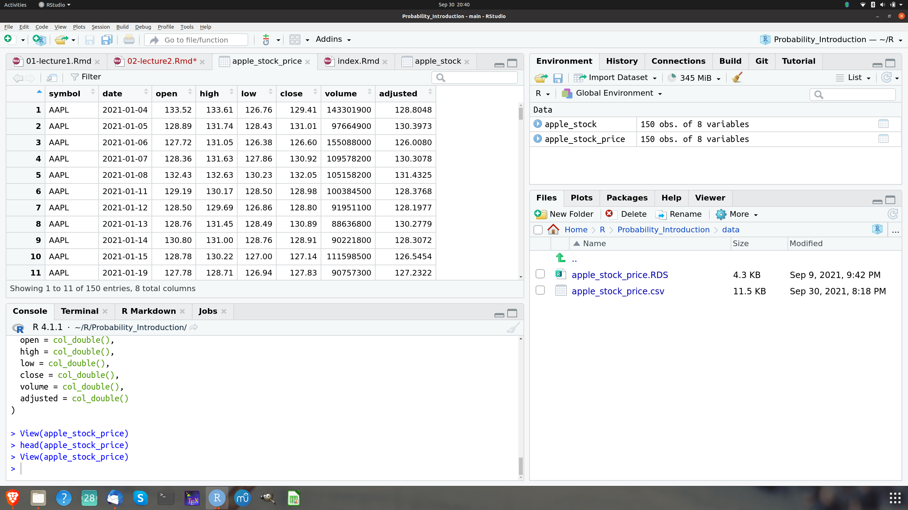

# Overflow Material

## lecture 1:

### The stock price of Apple

Since the context of this course is Computational Finance, let us discuss an example from
Finance first: The
stock price of Apple is recorded daily. Let us use this example to make a first step in
loading data into R. We have already learned how we could have a first quick glance at 
how they look like. We will discuss various ways to get financial data as we go along. For this
initial example we have prepared a data file for the Apple stock price from January 2021 to
the beginning of September 2021 and we have stored the data (in some format) locally. In
practice we often will not have data ready fro retrieval but will have to retrieve them from the
web, from a database or from other sources but let us not worry about these practical details
for the moment. We have stored the data in an R internal format, called RDS and we have stored the
file `apple_stock_prices.RDS` in a folder in our current working directory which we have
called `data`. Under this assumption we read these data and assign them to an R object
using the R function `readRDS`. Let us call
this object `apple_stock`:

```{r}
apple_stock <- readRDS("data/apple_stock_price.RDS")
```

To have a first look at the data, we use the R-function `head()`. This is a very useful function
to glance at the data because instead of shwoing us the entire, possibly very big, dataset it 
shows us just the first few lines. We can even specify how many by specifying a parameter
for the number of lines we want to display, say 10:

```{r}
head(apple_stock, n = 10)
```
Now we see what is contained in  the data. They are organized in a table. Each column is a
variable, starting with the stock symbol of Apple, then the date, the opening price, the 
highest, the lowest and the closing price, the volume and the adjusted volume. Every
row is a record of the values of these variables for a particular trading day in 
the time period we consider.

Now let us make a chart of the closing price at each day over the time period of our data using
the plotting function `qplot()` we already used for visualizing the outcomes of 
repeated die rolls. In order to do so, we create two new R objects which contain the date
and the column close. This means we need to select these two columns. 

We
will learn more systematically how to do this in R. For the moment we just show one
way to achieve this for the particular example:

```{r}
date <- apple_stock$date
price <- apple_stock$close
```

Now we load the library `ggplot2` and use the `qplot` function. As arguments we give the
qplot function the series of dates and the series of closing prices and set a display
option, called `geom` to "line" to get a line graph (instead of the qplot default of a point
graph)

```{r}
library("ggplot2")

qplot(date,price, geom = "line")
```

Now assume we are at the end of our price data series, at August 6th 2021. We want to
think about the uncertain price tomorrow. This is our random exmeriment. What would
be a suitable state space?

What are the possible prices Apple can attain? The minimum price is zero. The maximum price can
not be determined. In principle it could be infinite. The state space here would be an open
interval of real numbers, ${\cal S} = [0, \infty)]$. Quite complicated.

We could define the state space for the price change, in another way, by thinking about three
events: Up, denoted by $u$ when the stock price increases, Even, denoted $e$ when the stock price
does not move, and Down, denoted $d$ when the price decreases. From this perspective
the state space would be ${\cal S} = \{u,e,d\}$. A bit simpler than before.

There are more elegant and powerful ways to read and plot data in R. We used this particular
example just to show you one particular way. More details and more general insights 
how to do this we will develop as we go along.

### The change of a stock price two days from now

Suppose we want to study the random experiment of observing a stock price move twice. 
This is a random
experiment because whether the coin will go up (U) or down (D) is uncertain before we
make the observation, but once the closing price is published, the outcomes 
are clear. The sample space is
${\cal S}=\{UU, UD, DU, DD \}$. The event that the closing price at the end
of the first trading day will be higher is $A = \{UU, UD\}$. The event that the
stock price does not decrease is $B = \{UU\}$, which is also a 
basic outcome of the random experiment. 

While this example is so simple that we do not need a computer, let us take the opportunity to
introduce a new R function, which computes all possible combinations of objects. 
Let us first create a virtual price move by listing the possible moves at day 1 and
day 2.

```{r}
day_1 <- c("U", "D")
day_2 <- c("U", "D")
```

There are some new things here. Let us explain. First, while we used gray boxes to show you input
and output of code as it would appear if you interact on the console we use here a very convenient
feature in RStudio, which we will use from now on. 

We compose these lecture notes in a document
format, which allows the mixing of text and code. Whenever we write a piece of R code, it is shown
in a gray box, as before but without the ```>``` prompt. When you move the cursor 
on the gray box
now, you will see a copy icon in the upper right 
corner of the box. This will allow you to copy this
code snippet and use it in another document or on your console to execute it.

The second new thing is that we have used a new data type, which we will 
need very often: characters.
Characters can be used to form strings and R has many powerful functions to work with and operate
on strings. We will see many examples of this later. 
Strings are always between ```" "```, like this. Like
numbers, strings can be stored in objects and referred to later. But what we need here is actually
two strings in one vector. This is achieved by using the `c()` function of R. 
c stands for concatenation
and here it stores both basic outcomes of a price move in two single vectors `day_1` and `day_2`.

We can now pass these two virtual oves to the R function `expand.grid()`. 
This function will produce
the sample space of two price moves by computing all possible combinations of sequences of U and D
that can occur at the end of two trading days. 

```{r}
expand.grid(day_1, day_2)
```
Don't worry at the moment if you do not understand what the output 
format is and why the columns are
headed by **Var1** and **Var2** followed by the symbols `<fctr>`. We will come back to this.

Before we look at yet another sample, let us mention that this setup, simple as it may
seem, plays a very important role in the theory of random price 
fluctuations of asset prices and in 
option pricing and we will encounter it later in more detail.

### Birthdays and the Blockchain

Suppose we are interested in the probability that at least two students in a class 
of size $n$ share the same birthday. This is a very famous probability problem which
is often referred to as the *birthday paradox*. It is technically not really a 
paradox but it is called like this because this probability behaves in a surprising
way if viewed as a function of the class size $n$. We discuss the problem in the
context of computational finance because it has also an important application in
the design of crypto-currencies and the new field of decentralized Finance, which
make heavy use of cryptographic methods.

We will talk about actual probabilities in the next lecture. But in
this lecture we have learned that we can only talk meaningfully about probabilities if
we know the random experiment and the basic outcomes. One interesting aspect with respect to
the concepts of basic outcomes and sample space is that the birthday paradox example is
an instance where we cannot simply write down the sample space like in the example of
rolling a die.

The event we are interested in is that 
*at least two students in a randomly selected sample of $n$ out of class have the same birthday*. 
It turns out that it is easier to think about the complementary event, which is that 
*all students have different birthdays*. 

In terms of possible basic outcomes there
are $365^n$ possible outcomes if there are $n$ students in the class. Each of
them can have a birthday at any of the 365 days in the year and in total there are
$n$ students. 

So the sample space ${\cal S}$ for the conceptual 
random experiment that all $n$ randomly selected students have different birthdays
is the set ${\cal S} =\{1,2,\ldots, 356^n\}$ of basic outcomes. For 10 students this would
be

```{r}
365^10
```

basic outcomes for all $n$ students having different birthdays.

The birthday problem also plays an important role in cryptography, and its 
concept of hash-functions.
Hash-functions play a key role in the implementation of Cryptocurrencies. Let us explain this
context and what it has to do with Crypto:

A **hash-function** maps a string of arbitrary but finite length to a fixed length string 
of output. A
very frequently used hash-function in practice is the function SHA-256, which maps its input
to a string of 256 bits^[A bit, short for binary digit, is defined as the most basic 
unit of data in telecommunications and computing. Each bit is represented 
by either a 1 or a 0]. So, you could for instance give the text of the bible as an 
input to SHA-256 and it would map this into a 256-bit string, which functions like
a finger print of this text. This is a so 
called *one-way-function* meaning that it is easy to evaluate or compute but it is
practically impossible to learn from the value the initial argument by computing the inverse.

Hash-Functions are key pillars of modern cryptography, where they play a major role in message
authentication. This is because it is impossible to modify the input without significantly
changing the output. So in our previous example, if you only dropped one letter from the text
of the bible it would hash into a completely different value than the previous version which 
still contained this letter and you would immediately see from
comparing the hash-values that something has changed.

The collision problem for hash-functions is formally equivalent to the birthday problem. The event
we are interested in is that *at least two input strings hash-to the same value*. Again it
is easier to think about the complementary event that *all inputs hash to a different value*.

If the range of the hash-function is $M$ and the hash-function maps into a 256 bit string
then there are $2^{256}$ basic outcomes. Since the hash-function maps a large string onto
a smaller string it is possible that there are two different strings $x \neq y$ mapping
to the same value $\text{hash}(x)=\text{hash}(y)$. This would be a problem for message
authentification because it would give the same "fingerprint" for two different strings. For
a cryptographically secure hash function it is therefore required that the probability of
such a collision should be small enough to exclude a collision in all practically
relevant circumstances. We will take up the example again in the next lecture.

##lecture 2:

## Example continued

### The stock price of Apple

Let us go back to our example with the stock price of Apple. In this example we had expressed
the state space as ${\cal S}=\{U, D\}$. It is however impossible to determine the probability
for each of these two elements. It is also not possible to determine the probability
for each price which is theoretically possible.

### Tossing a fair coin twice

Assume we toss a fair coin twice and that the two possible outcomes 
of this random experiment is that the coin comes up heads $H$ or tails $T$. 
The state space of the random experiment of tossing a coin twice is
${\cal S} = \{HH, HT, TH, TT\}$. We can now ask: What is the probability of getting H 
after the first toss? Since the coin is assumed to be a fair coin each outcome of
the toss is equally likely. The probability of getting H after the first toss, must
therefore be $1/2$. Now we could ask: What is the probability that we get H after the second
toss as well? If you think about the situation, you will see that the probability of
getting H in the second toss is completely unaffected by what happened after the first toss. 
This probability is independent of the outcome of the first toss and since the coin is 
a fair coin it is also equally likely to get H as it is to get T. The probability of getting
H after the first toss is therefore again $1/2$.

Here we derived the equal probability postulate by an assumption, interpreting
the probability as a classical probability. 

We could also give this postulate a frequency
interpretation using our knowledge of R.

We proceed by analogy to our approach of rolling a die. Let us
therefore create a virtual coin first.

```{r}
coin <- c("H", "T")
```

As in the case of the die we next write a function, so we can virtually toss the coin

```{r}
toss_coin <- function(){coin <- c("H", "T")
                        sample(coin, size = 1) }
```

Now lets toss this coin 100 times by using the `replicate` function and 
save the result in an object called 
tosses_100:

```{r}
tosses_100 <- replicate(100, toss_coin())
```

Lets look at the outcome of the 100 tosses graphically

```{r}
qplot(tosses_100)
```
The histogram shows that the occurrence of Heads and Tails are almost 50/50 but not 
exactly. Lets toss 1000 times and then look again.

```{r}
tosses_1000 <- replicate(1000, toss_coin())
qplot(tosses_1000)
```
This looks already pretty good. Lets toss even more. Why not toss a million of times?

```{r}
tosses_m <- replicate(10^6, toss_coin())
qplot(tosses_m)
```
Now you see the idea of the frequency interpretation. The number of occurrences of H divided
by the total number of tosses comes closer to the $1/2$ probability as we toss many
times. We will come back to this idea again a bit later.

### Boys and Girls

We have introduced the four child family before in lecture 1 and asked you to figure out the
state space of the random experiment how the sequences of boys and girls might result in this
four children outcome.

If you have correctly figured out the state space, you will surely be able to 
tell which of the 
following sequences is more likely i.e. has the higher probability: `bbbb`, `bgbg` or
`gggg`?

Let's use the idea we considered first in coin tossing, and use the `expand.grid()` function
to figure out all combinations of boys and girls in a family of four kids. The outcome
of the sex of a baby at any of the four births is abstractly the same as a coin toss with
the possible outcomes: `b` or `g`.

```{r}
birth_1 <- c("b", "g")
birth_2 <- c("b", "g")
birth_3 <- c("b", "g")
birth_4 <- c("b", "g")
```

Now we can let R figure out all possible sequences of outcomes. We store the outcome in an
object called n and count the combinations using the R function `nrow()` which counts the
number of rows of a so called dataframe, a structure we discuss in detail in a minute.

```{r}
n <- expand.grid(birth_1, birth_2, birth_3, birth_4)
nrow(n)
```

There are 16 combinations in total. Applying the same reasoning as with the coin tossing
example, we see that the probability of each sequence should be equal to $1/16$. 

In reality
by the way births are slightly more likely for boys than girls. Gelman and Nolan report for
example the US numbers for the year 1981, where 1 769 000 girls were born, while there
were 1 860 000 boys: $48.7 \%$ of births were thus girls.

Let us come to our last example,illustrating the interpretation of
probability as subjective probability.

### Example: FinTech Start Up

Suppose you had a great idea for a path breaking FinTech innovation, which will disrupt
the banking landscape. To predict the success of this innovation in probabilistic terms
you could only use a subjective probability. There are no data you can rely on, since this
idea had not existed before. You can only rely on your experience and your belief in
your idea. There is no way you could use a classical or a relative frequency 
interpretation of probability.

### Example: The Apple stock price again

Let us go back to our Apple stock price data, we have used previously. We read the
data again from our data folder.

```{r}
apple_stock <- readRDS("data/apple_stock_price.RDS")
```

Our data store price information about 150 trading days. During these dates, as you can
convince yourself, the price went up on 72 days and it went down on 77 days. It didn't 
stay the same at any day. We get in total 149 counts because we need to drop one observation
to compute the changes in the price.

Now let us assume that the probability of a future up movement is $P(U) = \frac{72}{149}$, which
is about $0.48$ and the probability of a down movement is $P(D) = \frac{77}{149}$, which is
about $0.52$.

Now assume in addition that the performance of the Apple stock price on the current trading day is
independent of the performance of the Apple stock price on previous trading days. This means
that the probability of $U$-movements and of $D$-movements is unaffected by the number of
previous $U$ and $D$ movements. This is - of course - an assumption. You may think about
whether this assumption is reasonable.

Now let us consider a week from Monday to Friday: 


- What is the probability that the price of
Apple will increase on each of the consecutive days? 

There are five trading days, so we need to compute
$P(U \cap U \cap U \cap U \cap U \cap U)$. This is by our assumption of independence equal
to $P(U) \cdot P(U) \cdot P(U) \cdot P(U) \cdot P(U)$. By our probability estimate from
relative frequency this amounts to $0.48^5$, which amounts to $0.025$.

- What is the probability that the stock price will decrease either on Monday, Tuesday, Wednesday, Thursday or Friday and will increase on the other four days?

The probability that the $D$ movement happens, say on a Monday, is 
$P(D \cap U \cap U \cap U \cap U)$ or $0.52*0.48^4$ which is $0.028$.
We have in total five mutually exclusive scenarios:
$P(D \cap U \cap U \cap U \cap U)$, $P(U \cap D \cap U \cap U \cap U)$, 
$P(U \cap U \cap D \cap U \cap U)$, $P(U \cap U \cap U \cap D \cap U)$,
$P(U \cap U \cap U \cap U \cap D)$. Thus we have $0.028 + 0.028 + 0.028 + 0.028 + 0.028$
as the final probability of this event, which is $0.14$.

## Analyzing the stock price of Apple: More R concepts

By discussing some probability concepts within the context of stock price movements we looked
at the Apple stock price data. R gives us some powerful tools to work with such data
and they provide a very good example to teach you some more R concepts to enhance 
our toolbox.

## Loading Data

We loaded the apple stock price data from a file I had provided you in RDS format. This 
is not the usual way you will load data into R. The most common case will be that you
get a plain text file, usually in a comma separated form or csv for short. In the data
directory we have a version of the Apple stock price file we already have already worked with
in csv format (`apple_stock_price.csv`). If you open this file in a text editor it
will look something like this:

```
symbol,date,open,high,low,close,volume,adjusted
AAPL,2021-01-04,133.520004,133.610001,126.760002,129.410004,143301900,128.804825
AAPL,2021-01-05,128.889999,131.740005,128.429993,131.009995,97664900,130.397324
AAPL,2021-01-06,127.720001,131.050003,126.379997,126.599998,155088000,126.007957
AAPL,2021-01-07,128.360001,131.630005,127.860001,130.919998,109578200,130.307755
AAPL,2021-01-08,132.429993,132.630005,130.229996,132.050003,105158200,131.432465
AAPL,2021-01-11,129.190002,130.169998,128.5,128.979996,100384500,128.376831
AAPL,2021-01-12,128.5,129.690002,126.860001,128.800003,91951100,128.197662 ... etc.

```
Most languages used for data science applications can open plain text files and export data
as plain text files. This is why you so often find them. To load a plain text file into
R just click the `Import Dataset`icon in R Studios environment pane. Then select "From
text file". R-Studio will then ask you to select the file, you want to import. You can use the
wizard to tell RStudio what name to give to the data set (for example apple_stock_price). 
You can also use the wizard to tell
RStudio which is the separation character used in your dataset and which character is 
used to represent decimals (usually . in the US and , in Europe) and whether 
the data set comes with a row of column names or a so called header. To help you, the wizard
shows you what the raw file looks like as well what your loaded data will look like based
on the input settings. I recommend to unclick the box "Strings as factors" in the wizard. This
will ensure that all character strings are loaded as characters (and not converted tp so called
factors). Once everything looks right, click Import. You can examine the data in 
with the `head()` function.

Sometimes, for instance if you write a script, it is more convenient to use a direct command to
read a file. If the decimal sign is `.` (US convention) use `read.csv`, if it is `,` then use
`read.csv2()`. The syntax for this function, assuming that the file we want to read is in a 
directory called data and is named `apple_stock_price.csv` is

```{r}
apple_stock_price <- read.csv("data/apple_stock_price.csv")
```

Please use the help functions to study the details of this function. It is quite powerful.
You can inspect the entire dataset using the `View()`function. 
This command will open a View pane like shown in this picture, which you can use to inspect
all the data pretty much like in an excel sheet.

```{r, out.width='90%', fig.align='center', fig.cap='The result of calling the View() function', echo = F}

```

There are many more possibilities to import data into R from many other formats, which we will
not discuss here. The principle is basically always the same and we refer you to the help menus 
for further details.

## Saving Data

Data can be saved by using the `write.csv()` function. It allows you to export data as a
comma separated text file. (There are many more export or saving options we do not discuss here).
If we would like to save the apple_stock_price object we have just assigned to a csv file we
would write

```{r}
write.csv(apple_stock_price, file = "data/prices.csv", row.names = FALSE)
```

Wit this command R turns the R-object `apple_stock_price` into a csv file with the name 
`prices.csv` and stores it in a subdirectory called data. There are many possible
arguments you can set with `write.csv()` (see ?write.csv for details) but there are three
you should always use: First you should give `write.csv()` the name of the object you want to
save. Then you should give a name (if necessary with a path) to the object. Make sure to give
the full name with extension. Finally you should set the argument `row.names = FALSE`. It prevents
R from adding an extra column with a counting index for the rows. It is unlikely that another
program which reads the data will interpret the row name system correctly.

## Atomic vectors

An atomic vector is just a simple vector of data, like the die we have already constructed

```{r}
die <- c(1, 2, 3, 4, 5, 6)
die
```

We can use R to check whether `die`is a vector
```{r}
is.vector(die)
```

An atomic vector can have only 1 value also. Each atomic vector stores values as 
a one-dimensional vector and can only store one type of data. Different types
of data can  be saved by different types of atomic vectors. R recognizes 
altogether six basic types of atomic vectors: doubles, integers, characters, 
logical, complex and raw.´

### Doubles

A double vector stores regular numbers. In our data these are the columns open, high, low,
close, volume and adjusted. In general R will save any number you type as a double. Doubles can
be positive negative, large or small and can have digits or not. Ususally it is obvious
what type of object you are working with but you can check also.

Let us create a new object close by selecting the column lose`from apple_stock_price. In R
this is done by typing:

```{r}
close <- apple_stock_price$close
```

We use the symbol `$` followed by the name of the column we want to select and assign the
selected column to an object called `close`. Now check the type by invoking the `typeof()`function:

```{r}
typeof(close)
```

### Integers

Integer vectors store numbers that can be written without commas. We will not need them
very often in probability and finance, because you can save integers also as doubles.

Integers can be specifically created in R by typing the number followed by an upper case L.

```{r}
int <- c(-1L, 2L, 4L)
int
```

```{r}
typeof(int)
```

### Characters

A character vector stores small pieces of text. For instance the stock symbol is
such a character. Lets select the symbol column and check:

```{r}
symb <- apple_stock_price$symbol
typeof(symb)
```

The individual elements of a character vector are called strings. A string can contain more than
just one letter. Character strings can be assembled from numbers and symbols as well. We
have encountered characters in some of our examples already before.

It is easy to confude R objects with character strings and you have to be careful to avoid that.
For example `symb` is the name of an R object names symb, while "symb" in quotations is a string
containing the characzers symb. If you forget the quotation marks R will look for an object which
probably won't exist.

### Logicals

Locial vectors store TRUE and FALSE, Rs form of boolean values. Logicals are very helpful
for comparisons. Assume we are interested how many closing prices are smaller than 124.
We have already created an object `close`. So we would type

```{r}
close < 124
```

### Coercion

R implements a coercion system for types which always follows the same rules. Once you
are familiar with these rules you will find them very useful.

How does R coerce data types? If a character string is present in an atomic vector, 
R coerces every element in this vector to character strings. If the vector contains
logicals and numbers every TRUE becomes a 1 and every FALSE becomes a 0. The same coercion
rules are used when you try to do math with logicals

This is very convenient. Say we want to count the instances when
the closing price of Apple stock was smaller than 124, i.e. when the logical is TRUE. 
We can use the `sum()`function
for that because R will treat each TRUE as a 1 and FALSE as a 0 when used with an algebraic
operation.

```{r}
sum(close < 124)
```

We count exactly 24 days when this was true in our sample. As a consequence of this cool
feature we can compute the porportion of days in our sample when the stock price of Apple
was below 124 as

```{r}
mean(close < 124)
```

### Complex and Raw

These data types are much less common than the ones we discussed before. They
store complex numbers and raw bytes of data. At the moment we will not say much more 
about these two types.

## Lists

Lists are like atomic vectors because they group data into a one-dimensional set. However
lists do not group individual values but they group R objects, such as different 
atomic vectors or other lists. For example, you can make a list that contains
a numeric vector of length 31 in the first element, a character vector of length 1 in its second
and a new list with length 2 in its third. This is done by using the `list()`function:

```{r}
test_list <- list(100:130, "R", list(TRUE, FALSE))
test_list
```
`list` creates a list in the same way as `c` creates a vector. Seperate every element in the
list by a comma.

The double-bracketed indexes tell you which element of the list is beeing displayed. The single
bracketd indexes tell you which subelement of an element is beeing displayed.

## Data Frames

Data frames are the two-dimensional versions of a list. They are by far the most
frequent data structure we will use. For example the apple_stock_price object
we have created by reading the csv datafile is a data frame. Think of a data frame
as something like an Excel spreadsheet.

Data frames group vectors together into a two dimensional table. Each vector becomes a column
of this table. As a result each column can contain different types of data. The symbol
column contains characters, the close column contains doubles for example.
